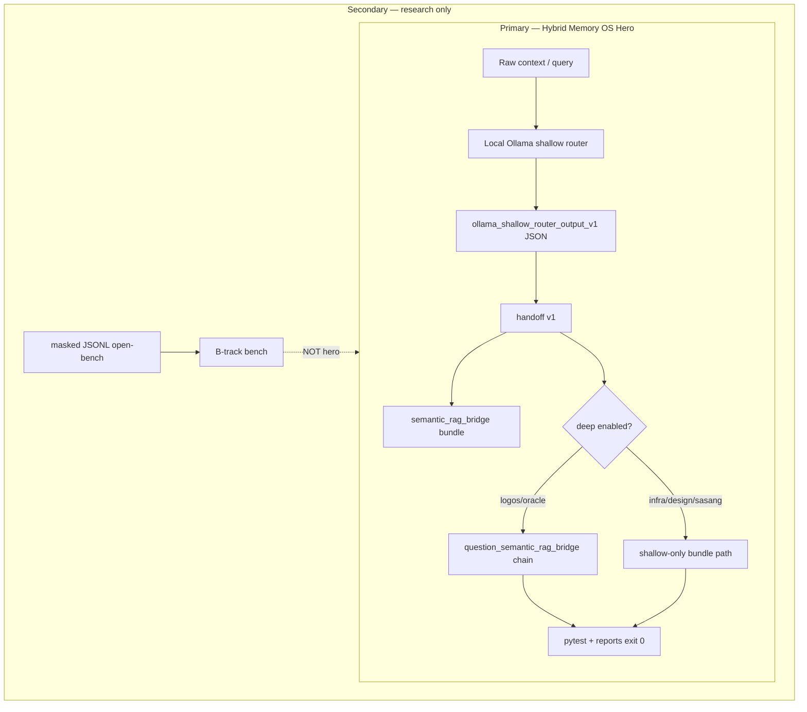
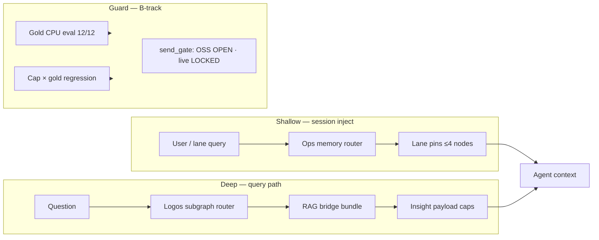

# MKM Knowledge OS — Repo-Native Hybrid Memory OS (Solo OSS)

**Stop dumping raw contexts into cloud IDEs.** Mount a deterministic shallow-routing pack on local Ollama (optional), inject lane-scoped pins instead of full-paste, and treat Cursor as orchestration — not a token incinerator. MIT · no counsel gate · no live-trading hooks.

License: **MIT License** — see [LICENSE](LICENSE)

> **Public export hero (`mkm-universal-root`):** English README SSOT → [`docs/final/artifacts/mkm_universal_root_readme_hero_en_v1.md`](docs/final/artifacts/mkm_universal_root_readme_hero_en_v1.md) · verify → `py scripts/build_mkm_universal_root_public_export_bundle_v1.py --verify-only`

---

## Universal Root — neuro-symbolic integrity kit (export hero · EN)

**Public repo:** https://github.com/mkmlab-v2/mkm-universal-root · 

**Track B `[HYPO]` · `research_only`** — not GPT-4 replacement · not fake-news firewall · not live trading.

```bash
git clone https://github.com/mkmlab-v2/mkm-universal-root.git && cd mkm-universal-root
pip install -r requirements.txt
python3 scripts/run_universal_root_oss_cursor_smoke_v1.py   # ~20s · exit 0
```

**Fixture bench (500 pairs, raw — do not collapse planes):**

| Plane | Metric | Observed |
|-------|--------|----------|
| Lexicon 41k | `prime_hit_rate` | **99.53%** |
| Lexicon 41k | `english_only_distortion_rate` | **0.47%** |
| Topology 31k | `verse_reachable_rate` | **99.53%** |
| Walls | exception cards | **2** |

**Dual-plane integrity:** `collapsed_combined_score: null` — lexicon and topology stay separate.

Full export README · manifest · materialize: see [`mkm_universal_root_readme_hero_en_v1.md`](docs/final/artifacts/mkm_universal_root_readme_hero_en_v1.md) · [`mkm_universal_root_public_export_manifest_v1.json`](docs/final/artifacts/mkm_universal_root_public_export_manifest_v1.json)

---

## Primary engine: local shallow → optional cloud deep

MKM decouples your repo workflow into two layers (both verifiable with **scripts + pytest exit 0**):

1. **Shallow routing (local Ollama, optional):** Emits fixed JSON (`ollama_shallow_router_output_v1`) with domain tag + `S/L/K/M` coordinates + anchor pointers — **metadata handoff intent** `[HYPO]`, not a hosted ingestion service.
2. **Deep fetch (Cursor / cloud when enabled):** Subgraph router → semantic RAG bridge → capped insight payload. **Queries and subgraph text can still leave the machine on this path** — not “coordinates-only for all paths.”

```text
[Raw context] → (local Ollama: shallow JSON) → [handoff v1] → (optional deep chain) → [pytest / artifacts]
                     lane pins (~4)              semantic RAG bridge
```

**Measured (latest shadow eval, 16 fixtures):** `routing_oracle_gap` **0.0** · `cloud_skip_ratio` **1.0** · shallow `router_hit_rate` **1.0** (live Ollama) — see [10-minute reproduce](#10-minute-hybrid-reproduce-primary-engine).

---

## 7-second Hero bench TUI (no Ollama)

Orchestration token-diet replay for README GIF / Show HN — **Hero lane only** (not Cursor traffic):

```powershell
# from repo root (after git clone)
py scripts/run_mkm_bench_tui_spike_v1.py --replay-only
# full refresh + TUI: py scripts/run_mkm_bench_tui_spike_v1.py
# plain text: py scripts/run_mkm_bench_tui_spike_v1.py --replay-only --plain
```

Artifact: `reports/mkm_bench_tui_spike_v1_latest.json` · pytest: `tests/test_mkm_bench_tui_spike_v1.py`

**Demo capture (GIF source):**

```powershell
# from repo root:
py scripts/run_mkm_bench_tui_spike_v1.py --replay-only
powershell -File scripts/Invoke-MkmBenchTuiDemoCapture_v1.ps1
# transcript: docs/final/artifacts/mkm_bench_tui_demo_transcript_v1.txt
# optional GIF: vhs docs/final/artifacts/mkm_bench_tui_demo_v1.tape
```

---

## Universal Root neuro-symbolic PoC (fixture smoke · no HF/Ollama)

See **[export hero (EN)](#universal-root--neuro-symbolic-integrity-kit-export-hero--en)** above for GitHub-facing copy. Details:

```powershell
# from repo root (Windows: py · Linux/macOS: python3)
py scripts/run_universal_root_oss_cursor_smoke_v1.py
# includes Launch Gate #1 path audit (--skip-path-audit to omit)
# artifact: reports/universal_root_oss_cursor_smoke_v1_latest.json
```

**Latest raw metrics (fixture path, dual-report — do not collapse):**

| plane | metric | value |
|-------|--------|-------|
| lexicon (raw) | `prime_hit_rate` | 99.53% |
| lexicon (raw) | `english_only_distortion_rate` | 0.47% |
| topology | `verse_reachable_rate` | 99.53% |
| walls | exception cards | 2 (`heal`, `learn`) |

Optional full Phase 17 chain (requires oracle tier-1 readiness): `py scripts/run_logos_graphrag_phase17_closure_observability_chain_v1.py`

**License note:** Repo is **MIT**. Optional local SLM paths (e.g. Meta Llama 3.2 / DeepNSM) are subject to **their upstream licenses** — see model card before redistribution.

---

## 10-minute Hybrid reproduce (Primary engine)

**Offline (~3 min, no Ollama):**

```powershell
# from repo root (after git clone)
py scripts/run_ollama_shallow_hybrid_reproduce_bundle_v1.py --skip-ollama
# artifact: reports/ollama_shallow_hybrid_reproduce_bundle_v1_latest.json
```

**With local Ollama (~10 min, includes 16-fixture bench + oracle gap):**

```powershell
ollama create mkm-shallow-router-v1 -f docs/final/artifacts/ollama_mkm_shallow_router_modelfile_v1.txt
powershell -NoProfile -ExecutionPolicy Bypass -File scripts/Run-OllamaShallowHybridReproduceBundle_v1.ps1
# optional slow logos deep chain:
powershell -NoProfile -ExecutionPolicy Bypass -File scripts/Run-OllamaShallowHybridReproduceBundle_v1.ps1 -IncludeDeepLive
```



---

## Secondary research lane (optional — not the product hero)

**Compression open-bench contributor kit** — for researchers verifying macro context compression on **masked JSONL** (`research_only`, B-track). This is **not** a data-processing SaaS, commercial ingestion service, or “send us your documents” pipeline. `SEND_GATE: HOLD` · no auto Track A promotion.

Pointers: `docs/final/artifacts/compression_open_bench_contributor_kit_v1_latest.json` · separate mirror `a-codeai-compression-reproduce` when publishing compression-only demos.

**Related work (B-track):** [`docs/research/NEXT_GEN_HYBRID_AI_MKM_MERGED_LIT_REVIEW_2026-06-20.md`](docs/research/NEXT_GEN_HYBRID_AI_MKM_MERGED_LIT_REVIEW_2026-06-20.md)

---

## Install ladder (pick your tier)

| Tier | You are… | What you get | Reproduce (exit 0 = OK) |
|------|----------|--------------|-------------------------|
| **0 · Smoke** | Fork curious | MIT, disclaimer, secret wall | `py scripts/check_mkm_solo_oss_release_readiness_v1.py` |
| **1 · Cursor-only** | Generic Cursor user | Stop pasting MISSION_LOG-sized blobs; lane inject (~4 pins) | `powershell -File scripts/Invoke-MkmCursorSessionUpgrade_v1.ps1` then bench below |
| **2 · Hybrid** | Ollama + IDE | Local classify / shallow path + Logos deep fetch (B-track) | `py scripts/run_mkm_ltm_orchestration_bench_bundle_v1.py` + optional chain in Tier 2 block |
| **3 · Monorepo** | Extending this repo | Full scripts + tests per `B_subset` scope | `docs/final/artifacts/mkm_github_public_release_scope_v1_latest.json` |

### Tier 0 · Smoke (~5 min)

```powershell
# from repo root (after git clone)
py scripts/check_mkm_solo_oss_release_readiness_v1.py
py scripts/check_mkm_secret_patterns_v1.py
powershell -NoProfile -ExecutionPolicy Bypass -File scripts/run_mkm_secret_scan_v1.ps1
```

### Tier 1 · Cursor-only (no Ollama required)

Resume / lane inject instead of naive full-paste:

```powershell
powershell -NoProfile -ExecutionPolicy Bypass -File scripts/Invoke-MkmCursorSessionUpgrade_v1.ps1
# lane-specific: add -Lane oracle | ms | infra | design
```

Measure shallow savings vs naive baseline:

```powershell
py scripts/run_mkm_ltm_orchestration_bench_bundle_v1.py
# artifact: reports/mkm_ltm_orchestration_bench_v1_latest.json
```

Agent rules entry: `AGENTS.md` · resume pack: `docs/final/artifacts/mkm_chat_resume_pack_latest.md`

### Tier 2 · Hybrid (Ollama-friendly + deep fetch)

**Start here:** [10-minute reproduce](#10-minute-hybrid-reproduce-primary-engine) (bundle script). Details:

Bring your own models (e.g. `OLLAMA_MODEL` in `.env.example`). Shallow routing stays local; deep path may still call cloud IDE / API when you enable it.

```powershell
powershell -NoProfile -ExecutionPolicy Bypass -File scripts/Run-OllamaShallowHybridReproduceBundle_v1.ps1 -SkipOllama
ollama create mkm-shallow-router-v1 -f docs/final/artifacts/ollama_mkm_shallow_router_modelfile_v1.txt
powershell -NoProfile -ExecutionPolicy Bypass -File scripts/Run-OllamaShallowHybridReproduceBundle_v1.ps1
```

Optional showroom smoke (public chain):

```powershell
py scripts/run_showroom_job_topology_wiring_chain_v1.py --skip-pytest
py scripts/check_showroom_trust_viz_public_chain_v1.py
```

### Tier 3 · Monorepo extender

Recommended first public slice: **`B_subset`** (bench + showroom + Logos smoke; counsel legacy excluded). Before any public push:

```powershell
powershell -NoProfile -ExecutionPolicy Bypass -File scripts/Verify-GitWorkspaceSanity.ps1
# public push only: scripts/Push-GitHub-Explicit.ps1 -Acknowledge
```

---

## Before vs After (Blind Cursor → Orchestrated Cursor)

| Topic | Blind Cursor (naive full-paste) | Orchestrated Cursor + MKM | Label |
|-------|----------------------------------|---------------------------|-------|
| **Mechanism** | Paste huge logs/docs every turn | Lane pins + router + capped insight JSON | **Measured** (bench scripts) |
| **Token cost** | ~52k-token naive baseline in repo fixture | Shallow inject **~99.6%** vs naive; orchestrated path **~33%** | **Measured** |
| **API spend** | Cloud billed for full context each turn | Local shallow reduces what reaches cloud; deep fetch is on demand | **Hybrid** — not “zero cost” (GPU/time still apply) |
| **Privacy** | Entire workspace text may leave the machine | Shallow path injects pins, not full MISSION_LOG; deep fetch still sends query/subgraph when enabled | **Hybrid** — not “coordinates only” for all paths |
| **Citation integrity** | Model may paraphrase sources | Logos B-track: `verse_id` + `quote_hash` guards (research lane) | **B-track** — not universal code hallucination block |

Footnotes: numbers from `py scripts/run_mkm_ltm_orchestration_bench_bundle_v1.py`. Do **not** cite DMF 5×–242×, counsel signoff, or Track A live readiness from these benches.

---

## Show HN / community blurb (copy-paste)

**SSOT (compression / 41k lexicon bench — paste v2):** `reports/hangul_ko_lemma_hn_launch_paste_v1_latest.md`  
Regenerate: `py scripts/build_hangul_ko_lemma_hn_launch_paste_v1.py` · Launch checklist: `py scripts/build_hn_public_launch_checklist_v1.py`

**Title (lexicon bench lane):** MKM — deterministic context diet for Cursor/IDE (41k Logos lexicon + evidence-backed 18-ko overlay)

**One-liner (lexicon bench lane):** Three separate benches (never merge): ~**99.62%** LTM pin skim (live E2E), ~**47.12%** Golden-40 offline compress (SSOT), Ollama **16/16** fixtures + live **8-row** chain OK — short E2E payloads hit **<4000 token gatekeeper bypass** (0% saving by design). Reproduce after public repo — not `git clone` today.

**Body (short — see paste SSOT for full MAIN):**

```
Three benches: context pin skim (tiktoken) · Golden-40 offline compress (Logos lexicon, not a Korean dictionary) · local Ollama router.
Live integrated smoke: 8/8 hops HTTP 200; bypass on short payloads is by design (<4k tokens).
Honest drift: disk ACTIVE 47.54% vs pointer intent 48.8% — cite lane, do not average.
MIT · SECURITY.md · SEND_GATE HOLD · no live trading.
```

---

### Show HN (Knowledge OS / hybrid memory lane — legacy blurb)

**Title:** MKM Knowledge OS — repo-native hybrid context layer for Cursor (measured bench, not a data SaaS)

**One-liner:** I got tired of pasting 50k-token ops logs into cloud IDEs. MKM injects lane-scoped pins and optional local Ollama shallow JSON handoff — **~99.6% token diet vs our naive-paste baseline** (repro script; not a cloud bill guarantee). No MKM-hosted ingestion server.

**Body (short):**

```
Show HN: MKM Knowledge OS — repo-native hybrid memory for Cursor (measured, not SaaS)

Hero bench (no Ollama):
  py scripts/run_mkm_bench_tui_spike_v1.py --replay-only

Full hybrid reproduce (~10 min offline):
  py scripts/run_ollama_shallow_hybrid_reproduce_bundle_v1.py --skip-ollama

With local Ollama Modelfile (gemma4:e2b):
  powershell -File scripts/Run-OllamaShallowHybridReproduceBundle_v1.ps1

Measured: shallow ~99.6% vs naive paste; orchestrated ~33%. routing_oracle_gap 0.0 on 16 golden in-domain fixtures only. OOD + Cursor proxy savings not claimed yet.

Secondary: compression open-bench — NOT the product hero.

MIT · SECURITY.md · SEND_GATE HOLD · no live trading.
```

---

## Why this repo

Most agent stacks burn context on full paste. MKM treats memory like an OS:

| Layer | Role | What it does |
|-------|------|----------------|
| **Shallow** | Session inject | Lane-scoped ops pins (~4 nodes) instead of pasting MISSION_LOG + CENTRAL |
| **Deep** | Query path | Subgraph router → RAG bridge → capped insight payload |
| **Guard** | B-track walls | `research_only`, gold CPU eval, send-gate vocabulary — **not** auto live trading |

Architecture label: **local Ollama-friendly shallow routing + cloud IDE deep fetch** (hybrid; you bring your own models).



---

## MKM-measured token bench (reproducible)

These numbers are **from this repo's scripts**, not external DMF/Mem0 marketing claims.

Reproduce:

```powershell
# from repo root (after git clone)
py scripts/run_mkm_ltm_orchestration_bench_bundle_v1.py
```

Latest artifacts (regenerable):

| Metric | Result | Source |
|--------|--------|--------|
| Naive baseline (MISSION_LOG + CENTRAL paste) | ~52k tokens | `reports/mkm_ltm_orchestration_bench_v1_latest.json` |
| Shallow lane inject (mean) | **~99.6% savings** vs naive | same |
| Orchestrated query path (router+insight+bloom) | **~33% savings** vs naive | same |
| Insight cap ablation (ultra_min) | **~56% smaller** insight JSON vs baseline caps | `reports/mkm_ltm_insight_cap_ablation_bench_v1_latest.json` |
| Gold router eval | **12/12 pass** (CPU, B-track) | `reports/logos_gold_query_eval_v1_latest.json` |
| Cap × gold guard | **`baseline_production` only** (minimal regresses 5/12) | `reports/mkm_ltm_insight_cap_gold_regression_v1_latest.json` |

**Bench snapshot:** open the JSON paths above after running the bundle, or paste the table into your launch post — do not use external compression marketing multiples.

### Measured (this repo) vs external research (not shipped)

| Topic | **Measured here** | **External research only** |
|-------|-------------------|----------------------------|
| Token / context savings | Shallow ~99.6%, orchestrated ~33%, cap ablation ~56% — scripts above | DMF, Mem0, LLMLingua marketing multiples |
| Router quality | Gold CPU eval 12/12; cap guard = `baseline_production` only; shallow `routing_oracle_gap` **0.0** (8 fixtures), `cloud_skip_ratio` **1.0** | Shepherding / UCCI as product claims |
| Cost routing / offload | Shallow-only path documented; oracle gap shadow only | RouteLLM 2–3.6×, CE-CoLLM 84% offload (not MKM KPI) |
| Memory accuracy | Gold **12/12** (Logos domain); shallow router_hit **1.0** on golden v1.1 | ByteRover LoCoMo SOTA as product claim |
| Routing collapse (RCI) | not measured | EquiRouter RCI metric |
| Release gate | MIT + README + secret scan + `Verify-GitWorkspaceSanity.ps1` | Paid legal counsel signoff |
| Hybrid stack | Documented pattern: local shallow + IDE deep fetch | “Fully integrated Ollama+Cursor product” |
| Trading / grants | LOCKED / HOLD in send-gate vocabulary | Track A readiness from B-track bench |

Prior-art log template: `docs/research/nextgen_ltm_knowledge_os/PRIOR_ART_SEARCH_LOG_TEMPLATE.jsonl`

**Related work SSOT (B-track):** [`docs/research/NEXT_GEN_HYBRID_AI_MKM_MERGED_LIT_REVIEW_2026-06-20.md`](docs/research/NEXT_GEN_HYBRID_AI_MKM_MERGED_LIT_REVIEW_2026-06-20.md)

### Hybrid stack narrative (EN — whitepaper-safe)

> MKM is a **research-grade memory orchestration stack** for hybrid agent development: **shallow lane-scoped injection** replaces naive paste of full operator logs (~99.6% token reduction vs internal baseline, reproducible bench), while a **deep semantic fetch path** routes questions through capped insight bundles rather than raw corpus dumps. Local **Ollama** can emit a fixed JSON handoff (`ollama_shallow_router_output_v1`) before the IDE deep layer runs; measured shallow routing on eight golden fixtures shows **`routing_oracle_gap` 0.0** and **`cloud_skip_ratio` 1.0** in the latest shadow eval (B-track, not production SLA). The architecture rhymes with recent **tiered agent memory** (MemGPT, ByteRover) and **edge–cloud routing** literature (RouteLLM, CE-CoLLM), but MKM’s public claims are limited to **scripts with exit code 0** — not external compression multiples (LLMLingua, FrugalGPT) or unimplemented schedulers (NSGA-II). Track B guards (`research_only`, gold CPU eval, live trading LOCKED) remain in force.

---

## Full local smoke (all tiers)

```powershell
# from repo root (after git clone)
py scripts/check_mkm_solo_oss_release_readiness_v1.py
py scripts/check_mkm_secret_patterns_v1.py
powershell -NoProfile -ExecutionPolicy Bypass -File scripts/run_mkm_secret_scan_v1.ps1
py scripts/run_mkm_ltm_orchestration_bench_bundle_v1.py
py -m pytest tests/test_ollama_shallow_routing_oracle_gap_v1.py tests/test_ollama_shallow_to_semantic_rag_e2e_v1.py -q
py scripts/run_showroom_job_topology_wiring_chain_v1.py --skip-pytest
py scripts/check_showroom_trust_viz_public_chain_v1.py
powershell -NoProfile -ExecutionPolicy Bypass -File scripts/Verify-GitWorkspaceSanity.ps1
```

---

## Public release policy (solo operator)

- **OSS path:** MIT + this README + secret hygiene — **no paid legal counsel gate**
- **Deprecated:** `counsel_signoff` / lawyer email bundles as a release blocker
- **Still HOLD:** grants, customer contracts, **Track A live trading** (commander LOCKED)
- **GitHub push:** internal-first; public push only via `scripts/Push-GitHub-Explicit.ps1 -Acknowledge`
- **1st public scope (recommended):** `B_subset` in `docs/final/artifacts/mkm_github_public_release_scope_v1_latest.json` (counsel legacy excluded)

Policy artifact: `docs/final/artifacts/mkm_solo_oss_release_policy_v1_latest.json`

---

## Security before you fork or publish

See [SECURITY.md](SECURITY.md). Never commit:

- `.env`, API keys, DPAPI secrets
- Local `MISSION_LOG.md`, machine-specific pointers
- Patient / grant / trading approval JSON

Root `.gitignore` blocks `.env` and local ops files. Before push:

```powershell
py scripts/check_mkm_secret_patterns_v1.py
powershell -NoProfile -ExecutionPolicy Bypass -File scripts/run_mkm_secret_scan_v1.ps1
powershell -NoProfile -ExecutionPolicy Bypass -File scripts/Verify-GitWorkspaceSanity.ps1
pre-commit install   # optional — blocked if git core.hooksPath is set
pre-commit run gitleaks --all-files   # fallback when gitleaks not on PATH
```

---

## Phase A — Geometric Audit demo bundle

Research spikes (B-track, not production SLA):

```powershell
py scripts/spike_gematria_myeongri_blend_v0.py --stdout-only
py scripts/spike_sovereign_token_saving.py --stdout-only --samples 20 --seed 1
```

---

## Disclaimer

**EN:** This project is observational open-source software for research and developer testing. It is **not investment** advice and not medical advice. You are solely responsible for your use.

**KO:** 본 프로젝트는 연구 및 개발자 테스트 목적으로 제공되는 관측형 오픈소스 소프트웨어입니다. 어떠한 형태의 금융 투자 및 의료적 판단을 대신하지 않으며, 사용 중 발생하는 모든 책임은 사용자 본인에게 있습니다.

B-track outputs carry `[HYPO]` / `research_only` — not operational triggers.

---

## More docs

- Agent entry: `AGENTS.md`
- Send-gate vocabulary: `docs/final/artifacts/mkm_send_gate_vocabulary_v1_latest.json`
- Lens walls: 성경(Logos) / 명리 / 사상 — Final action = regime_map + ops gates
