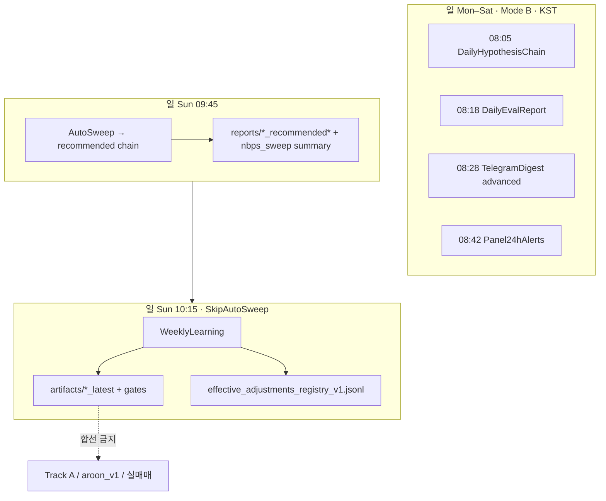

# Central agent memory v1 (cross-chat SSOT)

**목적:** 채팅은 맥락을 공유하지 않는다. 본 파일은 **Athena 정체성 + 이론 지문(고효율 압축) + 최소 진행 표**만 둔다.  
**구분:** **운영·핸드오프** = 루트 `MISSION_LOG.md` 작전 보드(영구, 2026-05-20~) · 본 파일 = **정체성·격벽 SSOT**(짧게). `CURRENT_OPS_SNAPSHOT.md`·`daily_thread_work_*` = **레거시·기본 미사용**.

### 다중 채팅 핸드오프 (고정, 2026-05-13 · **MISSION 단일판 영구 고정 2026-05-20**)

- **운영 SSOT (영구, 지휘관 확정):** 루트 **`MISSION_LOG.md` 맨 위 「전술 작전 보드」** — IDE 상시 오픈 · 채팅 재개 `@MISSION_LOG.md`. MS/Oracle **섹션 분리** 갱신(한 채팅=한 섹션).
- **스냅샷·일기 (레거시):** `CURRENT_OPS_SNAPSHOT.md`·`reports/daily_thread_work_*` — **기본 미사용**. 「핸드오프/스냅샷」 요청도 **작전 보드** 갱신으로 처리(별도 스냅샷 파일 **열지 않음**).
- **장기기억(본 파일):** 격벽·Fact-Lock·**분기 한 줄** — **MISSION Phase 표·완료 Evidence 일괄 이관 금지**. 체크포인트: `py scripts/athena_checkpoint.py "한 줄"`.
- **ARCHIVE ≠ CENTRAL:** `MISSION_LOG` 하단 완료 목록은 **같은 파일 안 보관**; 에이전트가 **자동으로** 본 파일(CENTRAL)에 넘기지 **않음**.
- **옵시디언:** Fact-Lock·핸드오프 체인에 **필수 아님** — 개인 보조·그래프; 레포 SSOT로 올릴 때만 `CENTRAL`/`CONSTITUTION`/`docs/research/RESEARCH_OPEN_QUESTIONS_V1.md` 등으로 **수동 승격·압축 한 줄**(아래 「옵시디언 볼트 vs 본 파일」절과 동일).

### MISSION_LOG 운영 SSOT (에이전트·지휘관, 영구)

| 구분 | 규칙 |
|------|------|
| **볼 것** | `MISSION_LOG.md` 작전 보드 + 해당 채팅 담당 섹션 |
| **안 씀** | 스냅샷·데일리 일기 · CENTRAL에 Phase 표 |
| **MS ∩ Oracle** | 서류·대외 문구 **0 합침** · 병렬 채팅=섹션 분리 |

**규칙 파일:** `.cursor/rules/mission-log-combat-ssot.mdc` (`alwaysApply`).

## 메타

- **schema:** `central_agent_memory_v1`
- **last_updated_utc:** 2026-06-12T05:59:45Z
- **owner:** (선택)
- **nl_sync:** `cross_notebook_query` · MKM·운영 노트북 15종 · **2026-05-12:** Action 4 **완료** — `b-track-philosophy-lane-rag-pilot-v1` → `internal/main`/`gitea/main` 철학 RAG + P0 + 금지어 SSOT; **`mkm-life`** 서브모듈 `27baaa4`(`mkmlife-com` `main`, 철학 RAG `route.ts` 병합 완료) · 코퍼스 기간은 NL에 보이는 노트 생성일 기준 **2026-01~04** (2025 노트북은 목록에 없음) · **2026-04-19** `sync_notebooklm_sources_to_mkm_data_vault.ps1` → Vault `notebooklm_sources` **OK**(복사 50; 매니페스트상 누락·optional 스킵은 정책대로 WARNING/회색 스킵) · **2026-04-28** NotebookLM MCP `server_info/notebook_list` live 확인(auth configured, owned notebooks 11, TOP1/TOP2/ Fusion Hub 포함) · **2026-05-05** 동 스크립트 재실행 **exit 0** `copied=104 skipped=91` → `G:\공유 드라이브\MKM_DATA_VAULT\vault\notebooklm_sources` **OK** · **2026-05-10** 동 스크립트 **exit 0** `copied=62 skipped=136` → Vault 미러 **OK** (`docs/NotebookLM_sources_manifest.md` = Fact-Lock·Track C·운영 스냅샷 등 지휘부용 레포 원본 목록; 클라우드 `source_add`는 별도); 구현 계약 **메타 인지 봉투 v1**은 `CONSTITUTION_INFERENCE_IMPLEMENTATION_FACTS.md` **§1.3.1**·`scripts/mkm_meta_layer_envelope_v1.py`·회귀 pytest 8·Track C `-MetaLayerEnvelopePath`(비면 미실행)로 Fact-Lock 고정(NotebookLM 단독 근거 아님) · **2026-05-11** 레포 SSOT 갱신: `TRACK_C_IP_BUSINESS_PLAN_2026-04-17.md` **§3.11** 플랫폼 GTM·밸류에이션 냉정 정렬(미들웨어·2nd customer·빅테크 대응·수직·대외 수치 Fact-Lock); 상징→텍스트 **M30** `build_lens_music_prompt_runbook_webhook_health_summary_v1.py` → `docs/final/artifacts/lens_music_prompt_runbook_webhook_health_latest.json`·`trackc.lens_music_prompt_runbook_webhook_health`; NotebookLM 지휘부는 매니페스트 동일 파일 + Vault 미러 스크립트로 동기화(에이전트 채팅에 MCP 미주입 시 로컬 파일만 SSOT) · **2026-05-11** `sync_notebooklm_sources_to_mkm_data_vault.ps1` **exit 0** `copied=62 skipped=136` → Vault `notebooklm_sources` **OK** · **2026-05-13** MSME AI+ OpenData **제2026-327** 과제① SSOT 4파일(`business_registration_plan_v1.md`·`ai_opendata_challenge_2026_327_*`·`moksori_mega_commercialization_roadmap_from_repo_ssot_v1.md`) → `NotebookLM_sources_manifest.md` A표·지휘부 패킷·`sync_notebooklm_sources_to_mkm_data_vault.ps1` $SourceFiles 반영 → Vault 미러 **exit 0** `copied=66 skipped=136` **OK**; NotebookLM **클라우드(B)** MCP `get_health` **`authenticated=true`**(전용 Chrome 로그인 완료)·`ask_question` **OK** · `add_source`(text/url) **여전히 실패**(`Could not open the Add source dialog`; `session_id`+`show_browser` 무효) → **NotebookLM 웹 UI `source_add`**로 동일 4파일 수동 업로드 필요(레포 경로 불변) · **2026-05-14** NL 노트북 **레포 인덱스** — `RESEARCH_HISTORY_V1.md`: MCP **현행** 라이브러리만; 41개 과거=`docs/final/artifacts/research_history_notebooklm_snapshot_2026-04-12.md`; Vault `$SourceFiles`·`OPS_COMMAND_ANCHOR` 렌즈 팩에 현행 인덱스 반영 · **2026-05-14** Track C SSOT `TRACK_C_IP_BUSINESS_PLAN_2026-04-17.md` **§3.7.2** 실버 테크 `[DRAFT]` + `docs/research/RESEARCH_OPEN_QUESTIONS_V1.md` **RQ-009** (패턴 이식·구현 미단정; 로컬 옵시디언 요약 `memory/obsidian_vault/SPIRIT/10_Daily_Log/2026-05-14_silver_track_c.md`) · **2026-05-15** 실버 COGS 템플릿 슬림·`stt_routing_audit_log_v1` 스키마만 SSOT; NotebookLM `nlm` 렌즈팩 푸시(`Push-NotebooklmLensPacks_v1.ps1`·맵 템플릿·하이브리드 `-PushLensPacksToNotebookLm`); Vault≠NL
- **external_briefing_ref:** `athena_memory_bank.md` (Gemini prior-year memo, briefing only)
- **external_briefing_ref_v2:** `athena_memory_bank_v2.md` (time-series partition + firewall)
- **지휘관 보좌 프로필 (초개인화 v1):** `docs/final/schemas/commander_profile_v1.schema.json` · `docs/final/artifacts/commander_profile_v1.example.json` — `birth_anchor`·`myeongni_fact_ref`=엔진 Fact; `cognition_hypothesis`·`assist_coaching_v1`=`[HYPO]`·격벽만. 사주로 GTM·실매매·임상 단정 금지. 가족 앵커는 `family_anchors_ref`(딸 등).

## CF jemaai rulesets — 재발 방지 (Fact-Lock · 2026-05-22)

| 판정 | 규칙 |
|------|------|
| **403 + verify 200** | **scope** — 토큰 만료 아님 |
| **카운터 SSOT** | `reports/cloudflare_jemaai_scope_recurrence_v1_latest.json` · `reports/cloudflare_jemaai_scope_recurrence_log.jsonl` |
| **자동진행 시** | `record_cloudflare_jemaai_scope_recurrence_v1.py` → blocked면 **apply 스킵** · Op30에 `[CF-GATE]` 1줄만 |
| **지휘관 1타** | API Tokens → **동일** `cfut_*` 편집 → jemaai.cloud만 **WAF Edit + Cache Rules Edit** (mkmlife Analytics만 추가 **불충분**) |
| **CF UI (한국어)** | 커스텀 토큰 **가운데 열 = 검색** — **「영역 WAF」「캐시 규칙」 트리 메뉴가 없으면 정상**. `WAF`·`Cache Rules`·`Zone Read` **영문 검색** 후 Edit/Read 선택 (`JEMAAI_CLOUD_SHOWROOM_CF_EDGE_DASHBOARD_V1.md` §1) |
| **에이전트 금지** | 매일 새 토큰 · `CLOUDFLARE_API_TOKEN` 덮어쓰기 · 403 apply 반복 · **없는 KR 메뉴명으로 안내** · **jema-ai.com redirect에 DNS 토큰만 사용** |

**jema-ai.com vs jemaai.cloud (2026-05-23):** `CLOUDFLARE_RULESETS_API_TOKEN`이 jemaai.cloud WAF/Cache만 통과해도 **jema-ai.com dynamic redirect(/smartfarm 1-hop)는 별 scope**. triage `jema_ai_dynamic_redirect` · 스크립트 `setup_cloudflare_jema_ai_smartfarm_redirect_v1.py`는 `resolve_cloudflare_jema_ai_redirect_token`만 사용. 403+verify OK = **jema-ai.com Zone Rulesets Edit 1회 추가** (만료 아님). nginx 2-hop은 이미 동작.

**no1kmedi.com DNS (2026-06-01 · 재발 방지):** `reports/no1kmedi_public_dns_verify_latest.json` **`all_ok: true`** 이면 clinic/research/api **이미 운영 중** — **`CLOUDFLARE_API_TOKEN` DNS POST 10000 ≠ 장애**. 에이전트는 **토큰 새로 만들라고 반복하지 않는다** (`docs/final/artifacts/no1kmedi_cf_dns_ops_policy_v1.json`). API 레코드 동기화만 필요할 때: `Invoke-No1kmediCloudflareDnsEnsure_v1.ps1 -RequireApiWrite` 또는 전용 `MKM_CLOUDFLARE_NO1KMEDI_DNS_TOKEN`(전역 토큰 **덮어쓰기 금지**).

---

## Cursor 웹 자동화 3단계 (영구 고정 · 2026-05-22)

**지휘관 확정 — 앞으로 이 순서만.** 상세: `.cursor/rules/mkm-browser-automation-v1.mdc` · 채널 A=`browser_*`(IDE Features→Browser) · B=`openchrome`(**optional**; `Switch-McpProfile.ps1 -Profile with-openchrome`) · C=`notebooklm` MCP.

| 순위 | 지휘관 지시 예 | 에이전트 동작 | 브라우저 |
|------|----------------|---------------|----------|
| **1** | 「API로 해」「스크립트로」 | `scripts/*.py`·CF/AWS API·exit code·아티팩트만 SSOT | **띄우지 않음** |
| **2** | 「내장 브라우저로 확인」「localhost 스모크」 | `cursor-ide-browser` → `browser_*` (스냅샷·스모크) | IDE 패널만 |
| **3** | 「토큰 줄게」「로그인은 내가」 | **일반 Chrome(수동)** → `reports/*_LOCAL.json` 또는 `.env` → `Invoke-Apply*` 등 apply | **에이전트 로그인·클릭 금지** |

**Human Blocker (수동 SSOT만):** `dash.cloudflare.com`·Turnstile/캡차·은행·결제·K-Startup PMS 임시저장. openchrome/IDE로 여기 로그인 시도 → **무한 보안 확인** 재발(2026-05-22 확인).

**에이전트 NEVER:** 「로그인해서 클릭해 줘」로 CF/은행 진입 · openchrome으로 `dash.cloudflare.com` · Turnstile 우회 반복 · 실패 후 동일 브라우저 2회 이상.

**에이전트 ALWAYS:** 문(토큰/키)은 지휘관이 열고, 에이전트는 **API·스크립트·2순위 스모크**만. CF jemaai rulesets → `CLOUDFLARE_RULESETS_API_TOKEN` 분리 + `Invoke-ApplyJemaaiShowroomCfEdgeTokenFromSecret_v1.ps1` (위 CF 절).

**openchrome:** 제거 대상 아님 — **채널 B**, 지휘관이 **외장 크롬** 요청 또는 A 차단+승인 시만. CF 대시보드·Human Blocker에는 **쓰지 않음**.

---

## 운영 체크포인트 (자동, 1줄)

<!-- ATHENA_CHECKPOINT_V1_START -->
- **2026-06-12T05:59:45Z** — Hub UI Chassis v3 shipped: 3-pane inspector /hub+/hub/logos, pill discover, /hub/compression [DRAFT] demo, shell contract+approval map locked, live smoke pending verify
- **2026-06-12T05:59:11Z** — scheduler band gate wired: solo_ops+Sunday EnforceSoloBand; solo_stack_ready=41 band ok
- **2026-06-12T05:50:34Z** — /hub/logos VPS deploy+live smoke 11/11; Logos 4D topology hub JSON live
- **2026-06-12T05:48:44Z** — Wave7/final scheduler: MKM Ready 181->38; tier4 SSOT; prophecy holdout+showroom VPS trim; total stack 41 Ready
- **2026-06-12T05:47:30Z** — Cursor 컨텍스트 다이어트 완료: AGENTS 2층(76줄)·cursorrules Slim v2(60)·core8 rules·diet+CI·User Rules minimal v1·재시작 후 strict PASS
- **2026-06-12T05:41:16Z** — P0 Logos 4D topology batch(28741 verses) + /hub/logos observatory plugin·contract·DesignLane exit 0
- **2026-06-12T05:39:55Z** — Wave6 scheduler: Ready 181->47 (-74%); 12 batches weekly/review_other; solo_target_band 55-70; reconcile ok
- **2026-06-12T05:33:40Z** — Moat PR-gate prep: pr-strict manifest OK; prophecy bench Brier 0.222; a-codeai READY_FOR_PUBLIC_OPEN_BENCH 9/9; external community PR next; SEND HOLD
- **2026-06-12T05:29:40Z** — Moat SSOT: GitHub contributor_provided 본선(실고객 없음); passive loop_ok hub 10/10 Moat 13/30 pass_rate_met false; SEND HOLD
- **2026-06-12T05:27:28Z** — Wave5 scheduler: Ready 181->100 (-81); 12 batches research/ops dup; Aramaic daily registry Disabled; reconcile ok
- **2026-06-12T05:21:30Z** — User Rules minimal v1.txt·MCP 카탈로그 가이드 AGENTS 반영
- **2026-06-12T05:17:04Z** — cursorrules Slim v2(147→60줄)·diet cursorrules+template drift·CI 연동 완료
- **2026-06-12T05:03:06Z** — Design hub: gitea/main 1aeb25518e package CTA+smoke 10-check; live 10/10; SSOT/canvas 10/10; SEND HOLD
- **2026-06-12T04:57:23Z** — Wave4 scheduler: Ready 181->144 (-37); myeongni/logos/kospi/btrack99 batches; triage regen; reconcile ok
- **2026-06-12T04:52:29Z** — MS/Compression: VPS deploy exit0·hub live smoke 10/10 customize CTA live·SEND HOLD·다음 Moat PR
- **2026-06-12T04:47:16Z** — MS/Compression: customize pillar+package CTA·DesignLane exit0·pilot auto-local chain_ok 25; prophecy closure safe_ops degraded; SEND HOLD
- **2026-06-12T04:37:44Z** — scheduler wave2-3: Ready 181→160; triage JSON; LiveSync registry Disabled
- **2026-06-12T04:36:57Z** — 채팅종료 RQ-031/032 [HYPO]: 연대기×역사→era chain exit0; RQ-032 KOSPI 제거·text_blind locked 9.1% MS cite; ops·Track A·SEND 무관
- **2026-06-12T04:32:08Z** — RQ-032 인류역사→era 전용 [HYPO]: KOSPI 제거; text_blind locked 9.1% MS cite; gold_tags 70.2% 상한; quad strict 0%; ops·Track A 무관
- **2026-06-12T04:28:32Z** — RQ-031 long KOSPI: 7261d·Pillar A combined strict 8.1%·B stress vol 1.68·era 70.2%/locked 45.5%; ops·Track A 미변경
<!-- ATHENA_CHECKPOINT_V1_END -->
---

## 질문 유형별 답변 라우팅 (권장 · 지휘관·에이전트 복붙)

**한 문단 템플릿:** 질문을 먼저 **A(운영·본선·경로·게이트·수치)** vs **B(연구·가설·내러티브·탐색)**로 나눈다. **A**이면 `docs/final/CONSTITUTION_INFERENCE_IMPLEMENTATION_FACTS.md`와 호출 가능한 `scripts/*.py`·`exit code`·`pytest`로만 답하고, **구현·통과·본선 반영 여부는 RAG·NotebookLM·채팅 요약 단독으로 단정하지 않는다.** **B**이면 내부 RAG·LLM·NotebookLM은 **보조 근거**로만 쓰고, 답마다 **`[FACT]`**(SSOT·스크립트와 일치)·**`[HYPO]`**(가설)·**`research_only`**(연구 격리) 중 하나를 붙인다. **한의 원전·Proxy B**, **DNA B-track**, **성경(Logos) 보조 해설**은 **실매매·Track A·프로덕션 자동 합선 금지**를 답변 끝에 한 줄로 명시한다. NotebookLM MCP는 채팅에 도구가 없으면 **로컬 매니페스트·Vault·CONSTITUTION**으로 폴백한다.

| 질문 예시 | 먼저 볼 것 | RAG·NL |
|-----------|------------|--------|
| **Cursor·장기기억·AI↔AI·자동 검증 여부** | `docs/final/CURSOR_SESSION_VALIDATION_BASELINE_V1.md` · `MKM_OPS_MEMORY_AI_TO_AI_DEV_ONE_PAGER_V1.md` · `.cursor/skills/mkm-cursor-session-ops/SKILL.md` | **alwaysApply ≠ pytest** · 사용량≠검증 |
| **큰 코딩 위임·Canvas vs To-Do·Auto 모드** | 본 파일 **「Cursor 위임 분류」** · `MISSION_LOG.md` 작전 보드 · `MISSION_LOG` §Cursor IDE 3층 To-Do | To-Do Complete≠승격 · 아래 표로 **에이전트가 먼저 분류** |

### Cursor 위임 분류 (에이전트 자동 · 2026-06-10 · 지휘관 Auto-only)

**3층:** `MISSION_LOG`(거시·다음 1타) → `todo_queue_v1`·`agent_decisions_log`(레포 중간) → Cursor To-Do/체크리스트(세션 휘발). **To-Do 전부 체크 ≠ Track A·live·MISSION 승격.**

| 규모 | 신호 | 에이전트 기본 루트 | 승인 |
|------|------|-------------------|------|
| **S** | 1레인·파일≤~15·AUTO만·당일 끝 | **To-Do/체크리스트 5개 이내** 먼저 → 실행 | 지휘관 OK 또는 TITAN 자율 |
| **M** | 반나절·pytest/스크립트 1체인 | To-Do + 종료 `athena_checkpoint` + `MISSION_LOG` 해당 레인 **다음 1타** | 동일 |
| **L** | 멀티레인·STOP/REVIEW·승인표·채팅 넘김 | **`delegation-*.canvas.tsx`** 또는 `reports/delegation_*_approval_map_*_latest.json` + MISSION_LOG 1줄 | STOP 노드 **human** |
| **HOLD** | `MISSION_LOG` **MS·상용** (340 paste·apply-active·SEND·Track A active) | **MS 능동 공사·대외 송부·ACTIVE 무쓰기 동결**; 패시브·DailyOpsPatrol **유지** | — |
| **B-track 연구(예외)** | Oracle·예언·`reports/*` | **허용:** 일일 Hypothesis 체인·freshness·recommended eval·주간 AutoSweep·nbps 그리드(`[HYPO]`) | **금지:** `combined_all_passed`·soft만으로 승격·live·SEND |

**Auto-only 지휘관 복붙(캔버스 대신):** `체크리스트 5개 이내 먼저 · 범위 한 줄 · 금지(MS paste/apply-active/Track A/live/SEND) · B-track reports 측정은 허용 · 끝 exit0+checkpoint`. **post-340:** `build_multi_res_todo_index_v1.py` → `reports/multi_res_todo_index_v1_latest.json` · `todo_queue` 자동 enqueue 금지.
| 구현 여부·경로·게이트 | CONSTITUTION + `scripts/verify_p0_constitution_gate_paths.ps1` + 해당 스크립트 | 설명 보조만 |
| 사상·DNA·시장 심리가 “다 합쳐졌나” | 헌법 표 **격벽**·일일 B-track 번들 절·`KOREAN_MEDICAL_CANON_INGEST_HANDOFF_2026-03-28.md`( A/B ) | `[HYPO]` 또는 `research_only` |
| 대외·제안·카피 | `PUBLIC_FACING_SECURITY_AND_IP_COPY_CHECKLIST_V1.md` + `TRACK_C_IP_BUSINESS_PLAN_2026-04-17.md` | 인용 각주만 |
| **환자·고3·소음인·복통·저혈압·수험 생활 설계** | **`docs/final/artifacts/patient_high_load_daily_optimization_playbook_v1.json`** (웜앤글로우·고부하 공학 설계 SSOT) + `patient_care_bundle`·`MKM_HEALTH_WELLNESS_COPY_GUARDRAILS_KR_V1.md` | **간지=FACT(MKM 엔진)** · **신강·용신=한의/포스텔라** · MKM `strength_label`·용신후보 **환자 단독 금지** |

### 환자·고부하 생활공학 기본 솔루션 (2026-05-23 잠금)

- **SSOT:** `docs/final/artifacts/patient_high_load_daily_optimization_playbook_v1.json` — L0 임상 주 · L1 뇌-장/저혈압/전정 · L2 체온·식이 · L3 학습 · L4 진로 · L5 달력 `[HYPO]`만.
- **우리 딸 (가족·실명 미기록):** **2012-03-28 10:20 서울** · 소음인(관찰) · 만14~15세 — `playbook` `family_anchor_our_daughter_v1` · 사주 **임진·계묘·무자·정사** · `reports/tmp_daughter_myeongni_full_v1.json`. **환자 김하은과 동일인 아님.**
- **우리 아들 이강민 (가족 anchor · 2026-06-07):** **2014-05-09 01:26 서울** · GH·당 관리 중 · 사주 **갑오·기사·경진·정축(일간 庚)** · `family_anchor_son_kangmin_v1` → `docs/final/artifacts/family_anchor_lived_calibration_son_kangmin_v1_latest.json` (**v1.1.0** · `clinical_labs_l0` 143/38 confirmed · lab numeric pending clinician SSOT) · 통합가이드 **`reports/kangmin_son_integrated_guide_v1.md`** · apply `scripts/apply_family_anchor_son_kangmin_lived_fact_check_v1.py` · **1순위=키·혈당·GH 연속성** · 소양/태양 [HYPO] · `auto_apply=none`.
- **딸 통합 가이드 v4-minimal (2026-05-25 · B-track):** SSOT `daughter_2026_integrated_guide_v4_minimal_latest.json` + `family_anchor` v1.3.0 — **순서:** v3 학교·멘토 → 명리 핵심월(재물·또래) → **사상 생활 4줄** → **Logos 2줄 [NON_GATING]**; **제품 브리지 [FACT]:** `build_family_anchor_insight_bridge_v1.py` · mkmlife `/oracle-sphere?profile=family` · blueprint `saving_the_news_blueprint_v1.md` §9; **금지:** 12칸 3렌즈 합선·오행%→체질·6월충 연애통제·11월 냉증 처방 · `auto_apply=none`.
- **환자 김하은 (진료 케이스):** **2008-02-03 14:00 서울** · 고3·소음인 등 — `playbook` `patient_reference_kim_haeun_v1` · **정해·계축·계유·기미** · `reports/tmp_kim_haeun_myeongni_full_v1.json`.
- **상담 톤:** 「고정밀 센서」·따뜻한 입력·마이크로 투두 — **「사주 강하니 버텨」·합격 단정·사주 인과」 금지** (`patient_care_bundle` 정책과 동일).
- **엔진:** 표·대운 → `run_saju_global_birth_v1` / `build_myeongni_full_report_v1`; 임상 강약·용신 → **변증·외부 만세력(조후·억부)**, MKM `yongsin_hypothesis`는 **연구 로그만**.

### 포스텔러 vs MKM 명리 교차검증 (Fact-Lock · 2026-05-24 · 증거 번들)

- **용도:** 우리 딸(`family_anchor_our_daughter_v1`) · 대외 비교·재현용. **월운 SSOT·육아 가이드에는 포스텔러 월운 UI 사용 금지.**
- **증거 SSOT:** `docs/final/artifacts/myeongni_porteller_vs_mkm_evidence_pack_v1.json` · 절기 갭 `reports/myeongni_2026_month_boundary_probe_v1.json` · 명식 `reports/tmp_daughter_myeongni_full_v1.json`
- **[FACT] 코어 일치:** 壬辰·癸卯·戊子·丁巳 · 8세(癸卯) 대운 · 2026 丙午(편인) · 가시 오행 37.5/25/25/12.5/0 — MKM↔포스텔러 2.2 붙여넣기 교차검증 PASS.
- **[FACT] 월운 UI 불일치:** 2026 丙午年 오호둔(寅月=**庚寅**) vs 포스텔러 UI 2월 **丙寅** 등 **12/12 월주 불일치** — `scripts/core/solar_term_ssot.py` · `PerfectManseryeok` 실측.
- **[FACT] MKM 한계:** `monthly_fortune`=양력 **15일** 스냅 · 매월 **1~14일** 절기 전월 잔존(경계표 참조).
- **[HYPO] 포스텔러 오류 원인** (소스 미확인): 甲己丙作首 혼용·60갑자 UI 루프 등.
- **허용:** 8자·대운·연운 **교차검증 꼬리표**만. **금지:** 월운 12줄·용신·신강·신살 → Parenting/학업 SSOT.
- **재현:** `py scripts/run_saju_global_birth_v1.py --utc-instant 2012-03-28T01:20:00Z --iana-tz Asia/Seoul`

---

## 에이전트 반복 루틴 (질의 없이, Fact-Lock)

대외·배포 작업을 매 세션 묻지 않으려면 아래 **파일 경로·exit code**만 따른다. NotebookLM·채팅 요약 단독 근거 금지.

| 트리거 | 할 일 |
|--------|--------|
| 대외 카피·보안·IP | `docs/final/PUBLIC_FACING_SECURITY_AND_IP_COPY_CHECKLIST_V1.md` + `docs/final/TRACK_C_IP_BUSINESS_PLAN_2026-04-17.md` (**§3.9–§3.10** 상징→오디오·감정 VA `[HYPO]`·비임상·Track Wall) |
| **어느 도메인에 어떤 쇼룸·허브 CTA 문구** | `docs/final/MKM_DOMAIN_PORTFOLIO_POINTER_V1.md` **§1.1**·**§1.1b** (표·CTA 초안); `docs/final/JEMA_AI_DOMAIN_POINTER_V1.md` §4.1 — **jema-ai.com Next 카피 원천(코드):** `projects/no1kmedi/marketing-site/public-copy.json` (`hub_links`; 공개 보드 권장 URL은 미니멀 HTML, `CONSTITUTION` Public Event Gateway 행 참조) |
| 공개 이벤트 스키마·지연 | `JEMAAI_CLOUD_PUBLIC_SHOWROOM_SPEC.md`(bitcoin-trading `jemaai-cloud-mvp`) |
| 로컬 검증 번들 | `scripts/verify_p0_constitution_gate_paths.ps1` → exit 0; 필요 시 `scripts/run_jemaai_cloud_completion_chain.ps1 -SkipP1AB` |
| 원격 반영 | **토폴로지 SSOT:** `MKM_HOSTINGER_CLOUDFLARE_TOPOLOGY_V1.md` — compute **Hostinger VPS만** · edge **Cloudflare만**. Git: `push-internal.ps1`. VPS scp: `sync_showroom_to_vps.ps1`, `Sync-MkmlabRedesignToVps_v1.ps1` (`MKM_VPS_HOST`·`vps-mkmlife`는 표기만 다를 수 있음). **hPanel `public_html` 금지.** — 에이전트는 **명시 요청 시에만** |
| **Google Gen AI · GCP 크레딧·벤치** | 과금 표면 **둘**: (A) Developer API 키 — (B) **Vertex AI** = `GOOGLE_CLOUD_PROJECT` + ADC → **프로젝트 Billing**(프로모션 SKU 범위는 콘솔 확인). 확인 `scripts/check_google_genai_readiness_v1.py check|smoke-vertex`; 채팅 스모크 `scripts/run_gemini_chat_smoke_v1.py --vertex`; 배치·멀티모달 `scripts/gemini_multimodal_batch.py [--vertex]`; **FACTS 벤치 완결(단일 플래그십·Vertex):** `scripts/run_facts_vertex_benchmark_v1.py`(기본 모델 `gemini-2.5-pro`) → 산출 `docs/final/artifacts/facts_vertex_benchmark_latest.json`·원클릭 `scripts/run_facts_vertex_benchmark_e2e_v1.ps1`. 키: `scripts/security_agent_manager.py`의 `resolve_gemini_developer_api_key` — env 우선·동명 DPAPI. **혼동 금지:** AI Studio 키만으로 “크레딧 자동 차감” 단정 금지. |
| **LG·압축·41k·이론** | **먼저** `docs/final/MKM_COMMANDER_PLAIN_LANGUAGE_SYSTEM_MAP_V1.md` + 「**41k·압축·LG — 통합 이해 한 장**」절 + factcheck. **6문장 검증**·**고정 응답 틀**만 사용. `이론 0%/100%`·NL 당선확률 **금지**. SSOT: `MULTILENS_*`·`original_language_master_atoms_summary_latest.json`(132万→41658). |
| **V2 압축 vs Logos RAG (3줄 · 2026-05-23)** | ① **V2 compress** = `evaluate_report` + 41658 lexicon **lookup** + `domain_router` — **Logos ANN 31102 verse RAG 없음**. ② **Logos RAG** = B-track only (`commander_daily_logos_anchor` 선택 ANN · O-P31c 대본 · philosophy/cross_lens 파일럿) — **`[NON_GATING]`**. ③ **`graph_wire_selective_bridge` Track A 기본 `false`** — B-track 스테이징만 `true` 검토. 상세: `MKM_COMMANDER` §4·§5. |
| **환자·고부하·수험 생활 설계** | `docs/final/artifacts/patient_high_load_daily_optimization_playbook_v1.json` → CENTRAL 「환자·고부하 생활공학」절; 간지만 필요 시 `run_saju_global_birth_v1` |
| **NotebookLM MCP 사용 턴** | (재발 방지 v1, 2026-05-09) **첫 호출 자가진단**: `notebooklm.get_health` 시도 → `tool_not_found`/timeout이면 **그 턴 안에 보고**하고 로컬 SSOT 폴백. 사용자에게 안내할 복구 순서: ① `scripts/check_notebooklm_mcp_prereqs.ps1` ② `scripts/repair_notebooklm_mcp_auth_stuck.ps1 -StaleNodeMaxHours 12` ③ Cursor Settings→MCP `notebooklm` toggle off/on ④ **새 채팅** 시작(도구 카탈로그는 채팅 시작 시 결정) ⑤ 그 채팅에서 `setup_auth`→`get_health`. `.cursor/mcp.json`은 **`npx -y …@latest` 금지**·**node + 핀버전 직접 실행** 고정(`MKM_NOTEBOOKLM_MCP_PINNED_VERSION` env). 로그오프 자동 정리: `MKM_RepairNotebookLmMcpStale_OnLogoff` (`scripts/register_notebooklm_mcp_repair_logoff_task.ps1`). |
| **Cursor MCP lean 프로필 (2026-05-31 · 응급 SSOT)** | **기본 7서버만:** filesystem · **athena-core(MKM12_LTM_DB_TYPE=file)** · sequential-thinking · athena-manseryeok · compression-server · devops-mcp · notebooklm. **복구 카드:** `docs/final/artifacts/mcp_lean_profile_emergency_recovery_v1.json` · 점검 `scripts/run_mkm_ai_v2_readiness_check.ps1` → `overall_passed=true`. **영구 제거(복원 금지):** `hostinger-website-manager`. **기본 제외:** `openchrome`(81 tools) — 필요 시 `scripts/Switch-McpProfile.ps1 -Profile with-openchrome` 후 Reload. **금지(기본):** playwright · manseryeok-mcp. **browser_tabs:** mcp.json 아님 → Features→Browser ON + **새 채팅**. VPS=devops-mcp+스크립트; Hostinger API=`scripts/run_hostinger_mcp.ps1` 수동만. |
| **MISSION_LOG·CENTRAL hygiene (2026-05-31 · 주간)** | **원클릭:** `scripts/Invoke-MissionLogCentralHygiene_v1.ps1` → 세션 **14줄** cap(`MISSION_LOG.sessions.md`) · CENTRAL 「분기별 한 줄」 **45행** cap(`docs/final/artifacts/central_timeline_archive_v1.md`) · **320줄** 초과 시 `split_mission_log_old_v1.py`. **예약:** `Register-MissionLogCentralHygieneWeeklyTask.ps1`(일 **06:30**) · 점검 `Verify-MissionLogCentralHygieneScheduledTask_v1.ps1` · 리포트 `reports/mission_log_central_hygiene_latest.json`. **재개:** `@MISSION_LOG.md` 작전 보드 + 최근 세션만. |

---

## NotebookLM → 장기기억 체화 (한 파일 SSOT)

**가능하다.** 단, **에이전트가 장기기억으로 쓰는 것은 NotebookLM이 아니라 이 파일(및 Git)**이다. NotebookLM은 **참고·요약 원천**이고, 그대로 두면 세션·채팅마다 달라질 수 있으므로 **압축·검증 후 여기에만 반영**해야 **체화**된다.

**NL RAG — 렌즈 분리(2026-05-14, 미니멀):** Google NL은 **노트북 1개 = 코퍼스 1목적**(Ops / TrackC / 명리 / 사상 / Logos / 압축·예언 / 이벤트). `MKM_CORE`류에 소스를 한꺼번에 넣지 말 것 — 인용 착시·질문 무관 스니펫 재발 방지. **표·경로 SSOT:** `docs/NotebookLM_sources_manifest.md` 「렌즈별 RAG — 노트북 1목적 매핑」·「외부 플로우 참고」(커뮤니티 NL→CLI→Obsidian 흐름 vs MCP·`docs/final/LLM_WIKI_SCHEMA.md`·로컬 렌즈 팩 `scripts/build_notebooklm_lens_source_packs_v1.py`; 서드파티 NL CLI·영상은 비-SSOT·합선 금지).

| 단계 | 내용 |
|------|------|
| 1. 수집 | NotebookLM에서 노트·요약·소스 인용문 확보 (선택). |
| 2. 검증 | **구현·경로·수치**는 `CONSTITUTION_INFERENCE_IMPLEMENTATION_FACTS.md`·스크립트와 대조. **불일치면 본 파일에 넣지 않음.** |
| 3. 압축 | 아래 **「NL 이관 압축」** 또는 **분기별 한 줄**에만 **고효율 한 줄**로 기입. 장문 붙여넣기 금지. |
| 4. 고정 | 커밋으로 버전 고정 → 모든 채팅이 동일 **중앙 메모리**를 읽음. |
| 5. 답변 | 에이전트는 **이 파일의 지문·표**를 우선하고, NotebookLM 내용은 **이미 이관·검증된 것**으로만 취급. |

**금지:** NotebookLM 출력만 보고 “구현됨/통과”라고 **이 파일에 적지 않는다.**

### 옵시디언 볼트 vs 본 파일 (개인 SSOT · 격벽)

**옵시디언은 인간의 로컬 SSOT, 본 파일은 에이전트·운영의 Git SSOT** — 자동 통합 장기기억으로 취급하지 않는다. 볼트 루트·폴더 역할은 `docs/NotebookLM_sources_manifest.md`(로컬 `memory/obsidian_vault/`·`MKM_OBSIDIAN_VAULT_ROOT`)와 동일 선상에서 본다.

| 규칙 | 내용 |
|------|------|
| **자동 미러링 금지** | 옵시디언 볼트 전체를 에이전트 “통합 장기기억”으로 자동 동기화하지 않는다. |
| **수동 승격만** | 옵시디언에서 검증·압축된 룰·한 줄 지시만, 지휘관 확인 후 **본 파일(및 필요 시 `CONSTITUTION_*`·스크립트)**에 반영하고 커밋으로 고정한다. |
| **`llm_wiki/raw/`** | 개인 일기·재무·가족 등 **원문 대량 적재 금지**(합선·불변 원천 오염 방지). |
| **TRADING vs SPIRIT** | 시장·매매 일지는 `TRADING/` 등 운영 권역, 사생활·감정 일기는 **`SPIRIT/10_Daily_Log/`** 등 — **폴더로 물리 분리** 유지. |
| **Cursor `@` (세션 격벽)** | 매매·시장 가설(B-track)·실행 코드 논의 세션에서는 **`SPIRIT/10_Daily_Log`·재무 등 사생활 문서를 `@`로 끌어오지 않는다.** 반면 `OPS/`·`CODING/`·`30_Resources/` 류 **운영·코드 메모**는 동일 세션에서 `@` 참조 가능. |

**안 A 경로 고정(한 볼트):** `memory/obsidian_vault/00_Inbox/` · `SPIRIT/10_Daily_Log/` · `20_Projects/` · `30_Resources/` · `SPIRIT/40_Review/` — 상세 표는 지휘관 확정본을 따른다.

### 연구·아이디어 인박스 (심사·토의 전용)

**목적:** 아직 `CONSTITUTION`·워크리스트·코드에 **고정하지 않은** 열린 주제를 한곳에 모아, 지휘관이 심사한 뒤 채팅에서 토의한다. **인박스 표만으로 구현·통과·본선 반영을 단정하지 않는다.**

- **Git 추적 큐:** `docs/research/RESEARCH_OPEN_QUESTIONS_V1.md` — 상태 `OPEN`/`HOLD`/`CLOSED`; 승격 시 `MULTI_LENS_INTERMEDIATE_LAYER_WORKLIST.md`·`CONSTITUTION`·스크립트·PR로 이관 후 행을 닫거나 삭제한다.
- **옵시디언(선택):** `memory/obsidian_vault/UNIVERSE_MKm/INBOX_연구_토의큐.md` — 그래프·개인 메모; 레포 큐와 **자동 동기화 없음** (`옵시디언 볼트 vs 본 파일` 절과 동일).

---

## VPS · 비트코인 본선 (혼동 방지 — 크로스 채팅 고정)

> **목적:** 런북·예시 파일의 **플레이스홀더 이름**과, 특정 호스트에서 **실측으로 확인된 PM2 앱 이름**이 다르다. 에이전트는 **아래 표 + 대상 호스트의 `pm2 list`** 를 우선한다. 구현 경로·게이트는 여전히 `CONSTITUTION_*`·스크립트가 우선(Fact-Lock).

**인프라 한 장:** `docs/final/MKM_HOSTINGER_CLOUDFLARE_TOPOLOGY_V1.md` — Hostinger VPS + Cloudflare만.

**경로 한 장 (vps-mkmlife · 2026-05-14+ 실측, 머신 SSOT: `docs/final/VPS_BITCOIN_LIVE_RUNTIME_POINTER_V1.json`)**

| 역할 | 경로 | PM2 / 비고 |
|------|------|------------|
| **본선 24h 실매매 (현재)** | `/opt/mkm-destiny-ai-41e38ec6` | `bitcoin-live-small-24h` → `projects/bitcoin-trading/start_live_trading.py` |
| **레거시 단독 클론** | `/opt/bitcoin-trading-live` | 과거 PM2 cwd(2026-05-04). **지금 본선 배포 대상 아님** — 디스크에 남아 있을 수 있음 |
| **랩·cron·ship 기본** | `/opt/mkm-lab-workspace-v2` | `ship_to_vps.ps1` 기본 `-VpsRepoPath`. **본선 PM2 cwd와 자동 동일 아님** |

| 항목 | 고정 (읽는 순서) |
|------|------------------|
| **원칙** | 문서의 `bitcoin-live` / 예시 ecosystem의 `mkm-btc-live` 는 **이름 후보·플레이스홀더**다. **재시작·배포 전에 대상 SSH 호스트에서 `pm2 list` / `pm2 show <name>` 으로 cwd·스크립트를 확인**한다. |
| **SSH 호스트 (로컬 ship 스크립트 기본)** | `vps-mkmlife` — `scripts/deploy/ship_to_vps.ps1` 의 `-VpsHost` 기본값. |
| **devops-mcp 실측 호스트(2026-05-04)** | `148.230.97.246` (`root`) — `project-0-workspace-devops-mcp`의 `check_vps_health`·`execute_vps_command` 성공. `pm2 list/show`는 기본 timeout(60초)에서 지연될 수 있어 `timeout=180`로 호출. |
| **실전 런타임 경로 (2026-05-14 SSH 실측)** | PM2 `bitcoin-live-small-24h`: **`status=online`**, `exec cwd` **`/opt/mkm-destiny-ai-41e38ec6`**, `script path` **`/opt/mkm-destiny-ai-41e38ec6/projects/bitcoin-trading/start_live_trading.py`** (`python3`). **2026-05-04**에 기록한 `/opt/bitcoin-trading-live` 트리는 **과거 실측**; 현재 본선 PM2는 **모노레포 루트 cwd**와 정합. |
| **VPS 설정 소스 (2026-05-14 SSH)** | `…/projects/bitcoin-trading/config/` 및 **`trading_config.yaml` 미존재**(해당 트리 `find`·`ls` 실측). 루트 **`/opt/mkm-destiny-ai-41e38ec6/.env`**에 **`TESTNET`**, **`ENABLE_TRADING`** 존재. **지휘관 터미널 실측(2026-05-14):** `TESTNET=false`, `ENABLE_TRADING=true` → `start_24h_daemon.py` 합성상 **메인넷 + 거래 활성**. `projects/bitcoin-trading/.env`는 **미존재**. 우선순위: YAML→모노레포 `.env`→`os.environ`. |
| **거래 경로 관측 (2026-05-14, 로그 샘플)** | PM2 **`bitcoin-live-small-24h-error.log`**에 `src.api.binance_client`의 **포지션 청산·진입·레버리지 설정**(예: BTCUSDT, 수량 0.001, 1배) INFO가 다수 — **위 `.env` 실측과 정합**(실주문 경로). 아론 루프의 **`ccxt=False`** = **`USE_CCXT`**(CCXT 미사용); **주문 비활성 아님**. |
| **보조 모노레포 경로(자동화/준비)** | `/opt/mkm-lab-workspace-v2` — `ship_to_vps.ps1` 기본값(`-VpsRepoPath`). **24h 본선 PM2 cwd는 위 행을 따른다**(이 트리와 자동 동일 아님). |
| **PM2 앱 이름 (실측)** | **온라인 24h:** `bitcoin-live-small-24h` — 동일 호스트에서 `bitcoin-live` 앱은 없음. 이름 변경 가능성이 있으므로 항상 `pm2 list`/`pm2 show` 실측이 우선. |
| **트리 정합** | **2026-05-14 실측:** `bitcoin-live-small-24h` uptime ~32h·restarts 18·`unstable restarts=0`. `/opt/bitcoin-trading-live`·별도 클론 `git` HEAD 브리핑은 **레거시 참고**; **재시작·설정·코드 동기 판단은 항상 `pm2 show`의 `exec cwd`·`script path`를 1순위**로 본다. |
| **배포 스크립트 적용 범위** | `scripts/deploy/linux/verify_and_reload.sh`는 **호출한 repo-path**에만 적용된다. `mkm-lab-workspace-v2`에서 성공해도, 실전 PM2 `cwd`가 **`/opt/mkm-destiny-ai-41e38ec6`**이면 그 트리에 `git pull`/검증 후 **`pm2 restart bitcoin-live-small-24h`** 등으로 반영해야 한다(경로 착각 금지). |
| **표 「분기별 한 줄」와의 관계** | 2026-05-02 `destiny` 브랜치 맥락·과거 `/opt/bitcoin-trading-live` 실측·현재 **`/opt/mkm-destiny-ai-41e38ec6` PM2 cwd**는 서로 다른 시점·트리다. 한 줄로 합쳐 해석하지 않는다. |

**에이전트 고정 (재발 방지 · SSH 호스트 재질문 금지):** 위 표에 **SSH 기본 호스트(`vps-mkmlife`)·PM2 후보(`bitcoin-live-small-24h` 등)**가 있는 한, 답변에서 사용자에게 **“SSH 호스트 이름을 알려주세요”**, **“다음 턴에 호스트만 주세요”**처럼 **기본 대상을 재요청하지 않는다.** 사용자가 **명시적으로 다른 호스트**를 쓴 요청이면 그때만 전환한다. 생존·주문 모드는 **로컬 Cursor가 추측하지 않고**, Fact-Lock 확인용 명령은 **기본 호스트 `vps-mkmlife` 기준**으로 초안을 제시한다(실행·출력은 SSH 측). 예: `ssh vps-mkmlife "pm2 list && pm2 show bitcoin-live-small-24h"` → `script path`·`exec cwd` 확인 후, **가능하면** `projects/bitcoin-trading/config/trading_config.yaml`을 확인하고, **없으면** 모노레포 루트 `.env`의 **`ENABLE_TRADING`·`TESTNET`** 등을 **SSH 원격에서** 확인(로컬 PowerShell에는 `grep` 없음 → `ssh … "grep …"`). **API 키·시크릿은 채팅에 붙이지 않음**; 불리언 플래그는 **레포 본 표**에만 고정.

**한 줄 요약:** 배포는 **`main` + FF** 가 기본이고, PM2 이름은 **호스트마다 `pm2 list`가 최종**이다.

---

## 조건부 시그널 게이트 · Binance USDM (경로 SSOT)

| 목적 | 진입점 |
|------|--------|
| 웹훅 전용(레거시 호환) | `projects/bitcoin-trading/scripts/run_conditional_signal_webhook_v1.py` → 내부에서 `run_conditional_action_gate_v1.py --backend webhook` 선행 |
| 백엔드 선택 | 동 디렉터리 `run_conditional_action_gate_v1.py --backend webhook` 또는 **`--backend api`** |
| 실주문 | 게이트에서 실거래 허용 조건 충족 후 **`--backend api`**; 주문 실행 단계는 스크립트 도움말·런북대로 **`--live`**·(의도 시) **`--mainnet`**; **선행(선택):** `run_conditional_action_gate_v1.py`에 **`--human-approval-json`**(또는 env `MKM_TRADING_HUMAN_APPROVAL_JSON`)이면 `validate_trading_human_execution_approval_v1.py` 선호출(exit 7); 파일럿 메인넷 소액은 `Run-BinanceUsdmPilotSmoke.ps1`가 기본으로 `reports/trading_human_execution_approval_latest.json` 요구 |
| 파일럿 스모크 | **`scripts/Run-BinanceUsdmPilotSmoke.ps1`** — 기본 dry-only. 테스트넷 실체결: **`-LiveTestnet -AcknowledgeLiveTestnet -RiskJson <fact_safe>`**. **소액 메인넷 실전:** **`-LiveMainnetSmall -AcknowledgeLiveMainnetSmall -AcknowledgeIrreversibleLoss -RiskJson <실제 fact_safe>`** + `-Qty`가 **`-MaxMainnetQty`(기본 0.002)** 및 선택 **`MKM_PILOT_MAINNET_MAX_QTY`** 상한 이하; **테스트 픽스처 risk 금지** |
| 일일 단일 판정 | `scripts/build_trading_go_nogo_status_v1.py` → `docs/final/artifacts/trading_go_no_go_latest.json` (gate + human approval + risk를 한 파일 `GO/NO_GO`로 고정; 주문 호출 없음; 기본 exit 1 on NO_GO; **관측 루프**는 `--exit-zero-on-no-go`) |

상세 한 페이지: `docs/binance_usdm_signal_webhook_setup_checklist_v1.html`.

---

## B-track LLM 번들 · macro / news (관측 한 줄)

**Fact-Lock:** 일일 체인은 선행 `scripts/build_btrack_news_macro_lens_adapters_v1.py` → `news_independent_lens_latest.json` / `macro_independent_lens_latest.json` → `build_btrack_llm_input_bundle.py`가 `artifacts`에 탑재; `generate_btrack_hypothesis_prophecy_v1.py`는 번들에 비어 있지 않은 `news_independent_lens` / `macro_independent_lens`가 있으면 **`macro_available`/`news_available` true**. 오프라인·직전 산출 재사용: **`run_btrack_daily_hypothesis_chain.ps1 -SkipNewsMacroAdapter`**. **Naver OpenAPI(`fetch_naver_openapi_signals_v1.py`)는 체인 기본 생략**; 네트워크 호출은 **`-IncludeNaverOpenApiRefresh`**(`.env`의 `NAVER_CLIENT_ID`/`NAVER_CLIENT_SECRET`·개발자센터 API 활성 전제). 루트 `.env`는 체인 시작 시 Process로 로드(UTF-8 BOM·UTF-16 LE·`export ` 접두사 허용). 상세·회귀 경로·**일일 체인 전 스위치 표**는 `CONSTITUTION_INFERENCE_IMPLEMENTATION_FACTS.md` 「일일 B-Track 번들」절 및 **바로 아래 `run_btrack_daily_hypothesis_chain.ps1` 스위치 표**. **복기 조립(가설+채점+선택 eval):** `scripts/eval_btrack_prophecy_post_mortem_v1.py` → `docs/final/artifacts/btrack_post_mortem_latest.json`; 주간 게이트 재점검 산출은 `docs/final/artifacts/trackb_weekly_gate_recheck_latest.json`.

---

## 로컬 워크스페이스 · 새 클론 SOP (표준)

> **맥락:** 매일 갱신되는 운영 산출물은 Git에 두지 않을 수 있어, **새 클론만으로는 로컬 “중간 재료”가 비어 있을 수 있다.** 후단 빌더만 단독 실행하면 입력 부족으로 중단될 수 있음(Fact-Lock).

**표준 순서 (중복 스크립트 추가 없음):**

1. **근본 재료:** `.env`(및 `.env.example` 대조)·외부 연동 키·Vault/네트워크 등 **스크립트 바깥 전제**를 먼저 갖춘다.
2. **최초 1회 풀 체인:** 별도 “부팅 전용” 래퍼를 만들지 않고, 이미 검증된 일일 러너 **`scripts/Invoke-MkmAiV2DailyReadiness.ps1`** 를 한 번 실행해 readiness·승격 포인터·Track C 패키지 연쇄·대시보드·가드까지 **순서대로** 로컬 산출물을 채운다.

**금지(운영 비대화):** 동일 목적의 두 번째 원클릭 부팅 스크립트를 레포에 추가해 관리 부담만 늘리지 않는다.

---

## 외부 브리핑 참조 (Athena Memory Bank)

- `athena_memory_bank.md`는 도메인/페르소나 정렬용 **브리핑 참조**로 사용한다.
- 과거 가설/확정 분리가 필요한 경우 `athena_memory_bank_v2.md`를 우선 사용한다(시계열 방화벽).
- 용어 교정(사심신물, 12 vs 8 체질, 자통)과 톤/협업 스탠스는 작업 중 우선 반영한다.
- 의료/디지털헬스/복잡계 맥락은 아이디어·설계 보조로 활용하되, 구현 완료 단정 근거로 쓰지 않는다.
- 구현·경로·성능·타임라인 확정은 `CONSTITUTION_INFERENCE_IMPLEMENTATION_FACTS.md`·스크립트·아티팩트가 우선이다.

### 시계열 방화벽 (Time-Series Firewall)

1. `[DEPRECATED]` 태그 항목은 코드/설계에 재도입하지 않는다.
2. `[BRIEFING_ONLY]` 태그 항목은 아이디어·문맥 보조로만 사용한다.
3. 구현·경로·성능·타임라인 주장은 `CONSTITUTION_*`·exit code·artifact로 재검증 후 반영한다.
4. 충돌 시 레포 SSOT가 항상 우선한다.

---

## NL 이관 압축 (검증 후만 · 최대 10줄)

> 아래는 **NotebookLM 소스 브리핑**을 교차 질의해 압축한 것. **구현·수치·경로는** 항상 `CONSTITUTION_INFERENCE_IMPLEMENTATION_FACTS.md`·스크립트로 재확인. 충돌 시 레포 SSOT 우선.

1. 투트랙: A(상용·범용)·B(리터럴·연구) **물리 격벽** — B→A 자동 합선·실매매 자동 트리거 **금지**가 소스 전반 반복 테마.
2. Fact-Lock: 판정은 **디스크·호출 가능 스크립트·exit code**; 브리핑·NL 수치는 **FACT/HYPO 분리**·단정 금지가 반복됨.
3. 레짐: **1차 실물·시장** vs **2차 성경·명리** 보조; 2차를 실전 트리거에 쓰지 않는 **주·보** 구분이 Fusion/Ops 소스와 정렬.
4. 멀티렌스: 로고스·명리·사상 **격벽** 유지, 단일 TOE·통일장 **완성 선언 금지** — NL·문서 관점 일치.
5. 예언 레일: 일반예언은 **루트 스키마·게이트** SSOT; 로고스 예언 파이프라인과 실물·실매매 엔진 **동일 프롬프트 혼재 금지** 브리핑.
6. 압축·품질: Jaccard·무결성·절감 등은 **재현 산출물**로만 강하게 주장; 브리핑 수치는 **검증 전 제한** — 압축 노트 요지.
7. 배포: 로컬·Sandbox·VPS **역할 분리**; jemaai 공개 쇼룸 vs 본선·조종실 **지연·권한 격리** — Ops 브리핑.
8. 단일 진입·게이트: `evaluate_report`·P1·직렬 pytest 등 **품질 게이트** 언급은 MKM_CORE 브리핑 — **실제 경로는 Fact 표 대조**.
9. 12AI·운영: 지휘·자동화는 **게이트·라벨**(FACT/HYPO/STRAT) 중심 서술이 많음 — **구현 여부는 코드만**.
10. **범위:** 위 요약은 **NL에 올라온 2026년 초~중순 자료** 기준; “작년 한 해” 전체가 아니면 **추가 소스 업로드 후 재동기화** 필요.

### Logos 원어 스택 — 세션 간 혼동 방지 (Fact-Lock)

1. **마스터 아톰** (`scripts/core/build_original_language_master_atoms.py`): 입력은 `verse_decoded_v2.jsonl`+외경+DSS; 고유형 ~4.2만·헬라 ~1.4만은 **요약 JSON**의 `unique_*` — **정규화·가벼운 휴리스틱**이며 완전 형태소 분석 아님 (`original_language_master_atoms_summary_*.json`·스크립트 note).
2. **레짐 특이점 리포트** (`scripts/core/build_original_corpus_regime_singularity_report_v1.py`): 구절→`build_gematria_metadata`→`build_gematria_4d_bridge`→레짐 지문과 **내적 스코어**; 물리적 에너지 아님·산출 `hypothesis_tier:B`.
3. **코퍼스 분리**: 두 파이프라인은 **동일 산출물이 아님**. 특이점 기본 인자는 DSS/외경 JSONL; 정경 전체를 쓰려면 **`--canon-jsonl`**로 `verse_decoded_v2.jsonl` 등을 넣고 레인 **`canon`**으로 분리(동일 스크립트에 2026-04-23 패치).

---

## 압축 B2B 파일럿 인입 (2026-06-11 · CENTRAL 증류 · `[HYPO]` 운영)

> **역할:** 채팅·Vault·F:백업 조사를 **한 화면**으로 복원. **전 레일·1년 맵** = `docs/final/COMPRESSION_RND_MASTER_INDEX_V1.md` (+ `artifacts/compression_rnd_master_index_v1_latest.json`). 수치·경로는 항상 디스크 SSOT 재확인. **Track A 47.5%·Golden40·파일럿 proxy 합선 금지** · **SEND_GATE: HOLD** 기본.

| 구분 | SSOT / 한 줄 |
|------|----------------|
| **R&D 마스터 인덱스** | `COMPRESSION_RND_MASTER_INDEX_V1.md` — 레일 맵·갭·Vault·외부 문헌·재현 명령 |
| **인입 킷** | `docs/final/artifacts/compression_pilot_target_intake_kit_v1_latest.json` — 마스킹 JSONL·면책·금지 헤드라인 |
| **3레인 (proxy·합치기 금지)** | ① `prospect-first-pilot-v1` golden40 내부 ~9% J~0.90 ② `public-open-web-v1` API/RSS ~17% ③ 고객형 `Run-CompressionCustomerPilotIntake_v1.ps1` (smoke ~14%) |
| **원클릭** | 내부 `Run-CompressionPilotIntakeBlueprint_v1.ps1` · 공개웹 `Run-CompressionPublicOpenPilotIntake_v1.ps1` · 고객 `Run-CompressionCustomerPilotIntake_v1.ps1` |
| **Track A (별도)** | `MULTILENS_ULTRA_COMPRESSION_ACTIVE_REPORT_V1.json` ~47.5%/J~0.89 — **파일럿 ROI·대외 헤드라인에 직접 쓰지 않음** |
| **거버넌스** | `ready_for_external_send: false` · counsel 전 HOLD · raw=repair_v2( PoC 경로 delta 0) |
| **12M 교훈** | `COMPRESSION_12M_LEARNINGS_AND_TRACKB_PLAYBOOK_2026-04-08.md` — zstd·벤더 겹침; **모트=컨트롤플레인·격벽·감사** |
| **pointer 비실현** | G: `comp_atom02_pointer_feasibility_summary_v1.json` — pointer_primary 불가; **zone_router+must_keep**이 현실 경로 |
| **외부 문헌 매핑** | `COMPRESSION_EVALUATE_REPORT_DATA_FLOW_V1.md` ACON(arXiv:2510.00615) ↔ Jaccard loss 패턴(개념만, 벤치 미실시 주장 금지) |
| **연대기 읽기순** | `COMPRESSION_RESTORATION_EVOLUTION_INDEX_V1.md` |
| **G: Vault** | `MKM_DATA_VAULT/vault/notebooklm_sources/comp_atom_compression_btrack` · `lens_pack_compression_btrack` |
| **F: 백업** | `F:\BACKUP\...\mkm-chore-gates` Phase5 Nitro·구 벤치 — **레거시 목표(70% 등) SSOT 아님** |
| **다음 게이트** | 진짜 고객 마스킹 JSONL 20–50행 + 동일 원클릭 → 1:1 proxy ROI만; counsel 후 SEND |

**에이전트 NEVER:** 세 레인 proxy를 하나의 고객 성과·SLA로 포장 · public-open/smoke를 케이스 스터디로 승격 · F:백업 70% 목표를 현행 파일럿 수치와 합침.

---

## Quant v3 unified pipeline [HYPO] (2026-06-11 · 증류 · `research_only`)

> **역할:** 외부 TSFM+Mamba+인과 통합 보고서 **의미만** 복원. **구현·벤치·경로는 `CONSTITUTION`·스크립트만 FACT.** 큐: `docs/research/RESEARCH_OPEN_QUESTIONS_V1.md` **RQ-025**.

| 층 | 한 줄 |
|----|--------|
| 인과 | F-PCMCI/CausalDRIFT → 인과 피처만 GBDT — 상관≠인과 |
| 신호 | TimeAPN(DWT)·Mamba-ProbTSF — 비정정성·분산 헤드 |
| 백본 | CMDMamba(저지연) + Chronos-2/Lag-Llama(제로샷·확률) |
| Ops | MCP + 통합 테스트 선행 + DESIGN.md 마이크로 태스크 |

**MKM 맵:** RQ-024-A flow/FRED = 인과층 **관측만** `[NON_GATING]` · `btrack_nextgen_*` = **압축 인덱서**(별 레인) · Oracle 0.55·Track A 47.5%·live **합선 금지**.

**PoC (2026-06-11):** `scripts/rq025_causal_feature_filter_v1.py` + `build_rq025_causal_feature_filter_poc_v1.py` → `reports/rq025_causal_feature_filter_poc_v1_latest.json` (flow **23행**, selected **3**; stub not tigramite).

**에이전트 NEVER:** 외부 SOTA%/「영구 우위」를 본선 주장 · v3 미구현을 CONSTITUTION에 박기.

---

## UI 3층 셸 (체화 10줄 · 2026-06-11)

> **원본→계약→체화.** ChatGPT/Gemini 미니멀은 **참고만**; mkmlife 소비자면은 **범용 채팅 사이드바 아님**.

| # | 지문 |
|---|------|
| 1 | **계약 SSOT:** `docs/final/artifacts/mkm_ui_shell_contract_v1.json` — `consumer_portal_v1` vs `operator_console_v1` 격벽. |
| 2 | **소비자(mkmlife):** 상단 nav **5개** + 카드 덱 — `SiteHeader`·`ConsumerPortalShellV1` 원본. |
| 3 | **운영자(WTT):** 좌측 sidebar `OperatorConsoleShellV1` — `operator_panel`·SEND HOLD·실고객면 합선 금지. |
| 4 | **게이트:** `py scripts/check_mkm_ui_shell_contract_v1.py` exit 0 · 디자인 클로저 번들 2b 단계 포함. |
| 5 | **팔레트:** `mkm_domain_design_tokens_v1.json` — 도메인별 accent 격벽 유지. |
| 6 | **카피:** `PUBLIC_FACING` + 계약 `copy_keys` — 47.5%·무한 채팅 **홍보** 금지(부정 문맥 제외). |
| 7 | **면책:** `NON-MEDICAL`·`NON-DETERMINISTIC`·`FINANCIAL-RISK` — `DisclaimerPanel` SSOT. |
| 8 | **UX 락:** 연속 채팅 기본 ❌ · 원퀘스천·관측·리포트 ✅ (`NO1KMEDI` §11). |
| 9 | **검증 루프:** `Invoke-MkmDomainDesignClosureBundle_v1.ps1` → `closure_ok: true` 전 “상용 UI 완료” 금지. |
| 10 | **Track wall:** UI 셸 통과 ≠ Track A·live·SEND 승격. |

---

## 이론 고효율 압축 — Athena 정체성 지문 (맥락 복원용)

> 아래는 **레포 헌법·AGENTS·Fact-Lock**에서 뽑은 **지문만** 압축한 것이다. 장문·내러티브 금지. 상세는 항상 `CONSTITUTION_INFERENCE_IMPLEMENTATION_FACTS.md` 등 SSOT.

| 지문 | 한 줄 |
|------|--------|
| 3+1 | 파이프라인 층: **Seed·Label·Formula·Field** — 만물이론·단일 방정식 완성 **아님** (Fact-Lock). |
| **세계관 v1** | Logos=말씀·초압축→만물; 역추론=신앙·해석; AI우주=창조 모방; 성경=경영프로그램·명리=우주통찰·사상=소우주·금화교역=변화심장 — `MKM_WORLDVIEW_AND_PHILOSOPHY_CONSTITUTION_V1.md` |
| 4D Seed | 순수 뼈대 `[S,L,K,M]` — 코드 4D와 Prism 논리 색인 혼동 금지. |
| Field | **“지금이 어떤 판인가?”** — 레짐은 역사 고유명(IMF·리먼·IT버블·코로나 등), 안정/주의/위험만으로 끝내지 않음. |
| 레짐 주·보 | **1차** `regime_map` 실물 **주** · **2차** 성경 매트릭스 **보** — 2차는 해설·리포트, **실전 트리거 금지**. |
| Multi-Lens | 로고스·명리·외경 등 **격벽** — 단일 TOE·통일장 완성 선언 금지. |
| Fact-Lock | 구현 여부·경로는 **디스크 + 호출 가능 `.py`/`exit code`** — NotebookLM·브리핑 단독 근거 금지. |
| 예언 레일 | B 레일 일반예언은 **루트 스키마/스크립트 SSOT** — 서브트리 이중 복제 금지. |
| 멀티레인 | 성경·명리·사상 **각각** 기준 통과 후 퓨전 — 한 레인 실패를 타 레인으로 메우지 않음. |
| 압축 트랙 | Track A 범용 / Track B 리터럴 — 격벽·상용 게이트는 `P0`·SLA 정책 선. |
| TITAN | Command-by-negation — 저위험은 합리적 기본값·사후 보고; 고위험만 승인. |
| 정체성 답변 규칙 | 전략·답변·코드 모두 **위 지문과 충돌 시 지문·SSOT 우선** — “그럴듯한 확장” 금지. |
| 에이전트 연속성 | **In-Turn:** 한 요청 안 다단계(토큰·시간·정책 상한). **Ops:** `scripts`·스케줄·exit code — 채팅 세션과 동일시 금지. **≠** 사람 새 입력 없는 무한 채팅 루프. 맥락 복구는 **이 파일·Git** + 「작업 맥락 레슨」(약 328-334행). |

---

## MKM AI 고도화 · 자체 LLM (의사결정 지문)

> 지휘관 질의: “규칙 주입 vs 가중치에 이론 체화”, “로컬 젬마4 등을 MKM 사고로 내장할지”. **구현 완료 단정은 Fact 표·스크립트로만** — 여기는 **전략 지문**만.

1. **층 분리:** Cursor 규칙·시스템 프롬프트 = **런타임 정렬(가중치 불변)**; 파인튜닝·어댑터 = **선험(prior) 변경**. 둘 다 “주입”이지만 **다른 레버**다.
2. **기본안(대부분 충분):** 규칙 + RAG + **게이트·eval·스키마**로 행동 고정. Fact-Lock·투트랙·레짐 주·보는 **프로덕트에 새기기 전에** 여기서 먼저 고정.
3. **자체 LLM/체화는 조건부:** 반복 출력 형식·금지 패턴·브랜드 톤이 **데이터·자동 채점**으로 정의되고, **규칙만으로 프롬프트가 비대**해 비용·일관성 문제가 **실측**될 때만 — 어댑터·좁은 파인튜닝을 **ROI 검토** (데이터 파이프라인·회귀 없으면 **오버엔지니어링**).
4. **속도:** 느림의 주원인은 “규칙” 자체가 아니라 **토큰 길이·호출 구조**; 학습으로 프롬프트를 줄이면 이득 볼 수 있으나 **학습 성공·평가 전제** 필요.
5. **재질의 시 응답:** 동일 주제 재질의 시 **본 절 + Fact 표**를 우선 인용해 답을 맞추고, NotebookLM·세션 감으로만 재정의하지 않음.
6. **맥락·의도 자산 (2026-06):** 업계는 코딩 에이전트에서 **성능 → 맥락/의도 축적**(벤더 메모리·대화 아카이브)으로 이동 중 `[HYPO·시장 관측]`. MKM은 **의도=레포 SSOT**(`MISSION_LOG`·본 파일·`agent_decisions_log.jsonl`·게이트 exit) — **채팅·벤더 Memory에 운영 맡기지 않음** `[FACT]`. **내부 머지 전:** `Invoke-CodingIntentGiteaMergePrecheck_v1.ps1`(`gitea`/`internal`·`main..HEAD`·manifest+precheck; **GitHub PR 비의존**) · 3점 링크·PR manifest·Fact-Lock **3d2e–3d2g** · `research_only` — **상용 의도 DB API**는 후속 `[OPEN]` — `TRACK_C` §3.11(7)·`RQ-010`.

---

## 명리 렌즈 고도화 v1 (MKM 표준 · 삼고 · 만세력)

> **목적:** 명리를 **중기 방향 코어**로 두되, 만세력·수학화·MKM AI는 **재현 가능한 산출물·스키마**로만 말한다. 날씨·일반예언 체인에서 온 통찰은 **캘리브레이션·홀드아웃·게이트·FACT/HYPO 분리** 같은 **운영 원리만** 차용하고, **명리 결정론 엔진과 데이터 자동 합선 금지** (§1.1 격벽·B→A 금지와 동일 방향).

### 답변·산출 규약

- **순서:** `Field(레짐)` → `Lens(사상/명리/성경)` → `Conflict` → `Final Action`; 성경은 `[NON_GATING]`, 최종 액션은 **1차 실물 레짐 + 운영 게이트**.
- **명리가 말하는 것:** 대운·월령·지장간·4D 블렌드 등 **구조·타이밍·중기 방향** 서사. **말하지 않는 것:** 실매매·임상·단일 운명 단정·TOE/통일장 완성 주장.

### 만세력 정확도 (Fact-Lock)

- **입력 1순위:** `birth_instant_utc`(ISO Z) + **IANA TZ** — `AGENTS.md` 만세력 절·`docs/final/artifacts/schemas/saju_global_birth_request_v1.schema.json` 계약과 정렬.
- **엔진 검증:** `scripts/run_manseryeok_validation_smoke_v1.py`(코호트·충돌 사전 등); 회귀 기준은 **`pillars_native`**; 외부 UI 스냅샷은 **`pillars_external`**로 분리 표기.
- **MCP 기본 경로:** 만세력 MCP는 **`athena-manseryeok`** 단일 기본(2026-04-30 CENTRAL 잠금과 정합); 상세 표는 `CONSTITUTION_INFERENCE_IMPLEMENTATION_FACTS.md` **§3.3·§3.4** 및 만세력 관련 행.

### MKM 명리 표준 스택 (구현 SSOT)

- **4D 융합 결정론:** `scripts/myeongri_complete_fusion.py` (`MyeongriCompleteFusion`), `scripts/run_manseryeok_bot_v1.py` (`analysis_depth=pro` 시 fusion·대운·起運·`vector_4d_rule_school_v1` 등); 지장간 LUT/가중·대운·`rule_school_mkm_4d_v1`·회귀 경로는 **`CONSTITUTION` §3.3 표**가 단일 색인.
- **독립 렌즈 v0/v1:** `scripts/run_lens_myeongni.py` + 계약 JSON·스키마; 봇→융합→렌즈 원클릭 `scripts/run_myeongni_lens_chain_from_bot_v1.py` / `scripts/Run-MyeongniLensChainFromBot_v1.ps1`.
- **LLM은 보조 해석만:** `docs/final/MYEONGRI_AI_INTERPRETATION_PROMPT_TEMPLATE_V1.md` + `docs/final/schemas/myeongri_ai_interpretation_envelope_v1.schema.json` + `scripts/run_myeongri_ai_interpretation_pack_v1.py` — **결정론 JSON 위 NL 봉투**; 쟁점·실전 최종 판정 금지.
- **대외 서술 어휘:** `docs/final/MYEONGRI_EXTERNAL_ENGINEERING_LEXICON_V1.md` (코드 식별자·스키마 키는 변경하지 않음).

### 삼고 수학화 (입력·엔진·출력 삼중 고정)

1. **고입력(考入力):** 요청 본문을 **스키마·타임존**으로 정규화; `scripts/saju_birth_resolver_v1.py` / `scripts/run_saju_global_birth_v1.py`와 동일 계약 유지; DST 모호 구간은 **추측 보간 금지**·에러 또는 명시 확인.
2. **고엔진(考引擎):** 만세력 스모크·`tests/test_myeongri_*`·지장간·대운·起運 회귀; dual-regime·트레이딩 그래프 쪽은 **`source_track: B`**·ledger 접두 등 **명리 네임스페이스 격벽** (`CONSTITUTION` §3.1·§3 전반).
3. **고출력(考出力):** `myeongni_independent_lens_v1` 등 **스키마 검증된 JSON**만 SSOT; 재현 해시가 있는 CLI는 §3.3의 `--deterministic-json` / `--hash-deterministic-json` 경로를 우선.

### 날씨·일반예언 레일에서 빌린 통찰 (원리만)

- **차용:** 라벨→`general_prophecy` 트리플·Brier·ECE·홀드아웃 — 루트 **`GENERAL_PROPHECY_SCHEMA_V1`** 및 `AGENTS.md` 「일반 예언(B 레일)」절의 스크립트 체인 (`scripts/run_weather_gt_to_prophecy_triplet_chain_v1.py` 등).
- **금지:** 날씨·가격 예언 JSON을 만세력/명리 4D **결정론 파이프라인에 자동 병합**; uplift·적중 주장은 **해당 eval 산출물** 없이 명리 해석에 끌어오지 않음.

### MKM AI (4AI 코어 + Absolute Balance Coordinator Mode)

- **층 분리:** 상위 절 「MKM AI 고도화 · 자체 LLM」과 동일 — 규칙·게이트·스키마가 **행동 고정**; 파인튜닝·어댑터는 **별 ROI·eval 전제**.
- **혼동 방지:** `mkm_ai_status_pointer_latest.json` 등 **운영 승격 스택**은 인프라·게이트 준비도이며, **명리 예측력·만세력 정확도 증명으로 읽지 않음**.
- **인덱스·P0:** `MKM_TRINITY_INDEX_V1.json`의 `lenses.myeongni.validation_pointers`에 본 파일(`docs/final/CENTRAL_AGENT_MEMORY_V1.md`) 포함; `verify_p0_constitution_gate_paths.ps1`이 동 파일 **존재**를 검사; `tests/test_mkm_trinity_index_v1.py`가 포인터 경로 **파일 존재**를 회귀 고정.

---

## LG HS · 에이전트 혼동 사태 재발방지 (2026-05-16 · 고정)

**사건:** 채팅에서 「이론 0%」↔「100% 반영」·「거버넌스만」↔「시장 독점」 널뛰기 + **22장 PDF** 페이지와 **9장 압축 IR 덱** 수치·페이지 **혼동**. 지휘관 인지 문제 아님 — **브리핑 수사 ≠ 디스크 SSOT**.

**3층 (A–B–C, 채팅 전 필수):**

| 층 | 내용 | SSOT |
|----|------|------|
| **A** | 철학·거버넌스 (Fact-Lock·외부 잠금·WATCH/HOLD) | 22장 PDF·`lg_hs_persuasion_module`·스크립트 |
| **B** | 압축 엔진 (샤드·휴리스틱·41k 렉시콘) | `report_multilens_performance_eval.py`·동결 JSON |
| **C** | 동결 수치 (~47.1%, floor 0.47, Jaccard ~0.885, 40건) | `MULTILENS_ULTRA_COMPRESSION_ACTIVE_REPORT_V1.json`·KPI summary |

**두 문서 (절대 혼동 금지):** (1) **22장 PDF** = 리스크·철학 스토리 (2) **9장 압축 IR 덱** `lg_hs_compression_discipline_deck_v1_latest.md` = 숫자·Moat 증명. **게마트리아 4D policy OFF** = 동결 C 측정값 — **「이론 전무」 아님**.

**LG 채널 (2026-06-01 · 종료):** `lg_hs_meeting_followup_v1.json` → `operator_channel_status.status=**CLOSED_REJECT**` — **활성 영업·미팅·후속·아웃리치 없음**. 아카이브·factcheck·9장 덱은 **과거 자료 인용만**; OpenData G4는 **327 제출 PDF에 타 채널 덱 미첨부** 확인(영업 작업 아님).

**LG·압축 관련 답변 전 (아카이브·수치만):** `lg_hs_before_after_factcheck_v1_latest.json` → `lg_hs_meeting_followup_v1.json`(채널 종료 확인) → (수치) `MULTILENS_ULTRA_COMPRESSION_ACTIVE_REPORT_V1.json`. **채팅만으로 수치·반영 여부 단정 금지.**

**금지 수사 (factcheck `FAIL_DO_NOT_USE`·지휘관 치트시트):** 7680 스윕·17/17·샤드마다 47%·Jaccard=의미%·「완벽 협업·사고 0%·10배 시장」.

**보안·게이트와의 관계:** Fact-Lock·P0·pytest는 **코드·산출물·실거래 합선**을 막는다 — **채팅 과장·문서 뒤섞기**는 별도. 재발 방지 = **위 SSOT 선독 + 경로 인용**.

**두 트랙 (절대 합치지 말 것):**

| 트랙 | 문서·산출 | 숫자·게이트 | MKM 이론 |
|------|-----------|-------------|----------|
| **세탁기 LG 22장** | `lg_hs_ceo_final_22slides_script_v1_2026-05-11.md` | WATCH/HOLD·코드북·보드 실측 잠금·골든 **300**(합성 PoC, `synthetic_combinatorial_v1`) | **A(철학·거버넌스)** 가전 언어로 **번역해 사용** |
| **압축 9장** | `lg_hs_compression_discipline_deck_v1_latest.md` | **47.1%**·floor **0.47**·Jaccard ~0.885·**40건** 벤치 · Moat/Plugin | **B(엔진)** + **41k 렉시콘**; **`apply_gematria_4d_bridge_policy: false`** → 47%에 4D 정책 **미적용** |

**0.47 ≠ WATCH/HOLD (오락가락 1순위 원인):** `0.47` = `ultra_saving_policy_min` (**토큰 절감률 하한**, Track A). 실크·90도·실행 보류 = **WATCH/HOLD** + 골든 `expected_action` — **별 게이트**.

**에이전트 답변 전 4문장 검증:** ① 지금 말하는 건 **22장 세탁기**인가 **9장 47%**인가? ② **0.47**인가 **WATCH/HOLD**인가? ③ **40건**인가 **300건**인가? ④ **4D policy OFF**를 「이론 0%」로 말하는가(A는 씀)?

**지휘관 확정 B2B 판정 (2026-05-16 · 채팅 SSOT 아님):** (1) **규칙·Fact-Lock·WATCH/HOLD·실측 잠금** = LG 포지션의 진짜 차별(알고리즘 신기술 주장 ❌). (2) **47.1% 압축** = MKM Track A **엔터프라이즈 조립**(샤드·41k·floor)이지 마법 코덱·게마트리아 KPI 아님. (3) **41,775 렉시콘** = MKM 코드북 데이터 자산(FACT). (4) **사기·개판 아님** = 타깃 패키징; **NotebookLM·채팅 「당선 확률 높음」** = 근거 없음. (5) **서울경제 AX 5/19 17:00+** 이메일 ≠ **LG 5/20** 결과 — 프로그램 분리.

**Track A 압축 · 4D bridge policy 트레이드오프 (2026-05-16 · 혼동 재발방지):**

| 질문 | 팩트 (레포 SSOT) |
|------|------------------|
| 동결 **47.1%** 조성 | **41k 렉시콘 ON** + **`apply_gematria_4d_bridge_policy: false`** — `MULTILENS_ULTRA_COMPRESSION_ACTIVE_REPORT_V1.json` |
| `track_a_policy_floor_decision_v1.json` | 렉시콘 조인 후 saving **~47.5%** → floor **0.49→0.47**; **health/ssot만** selective bridge (`cmp2_014` Jaccard **0.625→0.875**) — **「41k+4D 100% 융합→floor 붕괴」 메모에 없음** |
| bridge policy **ON** (40건 AB) | `MULTILENS_GEMATRIA_4D_UPLIFT_AB_V1.json`: saving **51.2%→36.8%** (Δ **−14.3pp**), Jaccard **0.801→0.917**, `ultra_saving_policy_ok: false` @0.49 · 보조 `MULTILENS_BRIDGE_POLICY_AB_ON/OFF_V1.json` |
| 「융합=전 축 박살」 | ❌ 과장 — **절감·floor는 깨짐**, **Jaccard는 오히려 상승** |
| 「융합=1초+ 지연」 | ❌ **이 AB 산출물에 latency 없음** — ms는 GPU 시뮬·API conc10 등 **별 층**; 인과 단정 금지 |
| 「4D OFF=이론 0%」 | ❌ — **상용 KPI에서 4D policy 끔**; 연구·메타는 `include_gematria_*` 별도 |

**압축 답변 전 5번째 검증:** ⑤ **bridge policy ON**을 말하는가 **OFF(동결 47%)**인가?

**한 줄 (대외·내부 공통):** 같은 multilens 엔진에서 **4D bridge policy를 켜면 절감↓·Jaccard↑·floor 실패 가능** — 상용 동결 47%는 **렉시콘 켜고 4D policy 끈** 조합; 재현 `scripts/run_multilens_bridge_policy_ab.py` · SSOT `MULTILENS_GEMATRIA_4D_UPLIFT_AB_V1.json`.

**41k 렉시콘 · 제작 시점 vs 구동 시점 (2026-05-16 · 혼동 재발방지):**

| 시점 | 무엇이 들어가나 | 게마트리아 4D |
|------|----------------|---------------|
| **제작(오프라인 Export)** | `data/logos/` 원어 코퍼스 → `build_original_language_master_atoms.py` → Strong(`map_master_atoms_lexicon_seed.py`) + MorphHB(`map_master_atoms_morphhb_seed.py`) → `export_master_codebook_v1.py` → **41,658행** (현행 SSOT; 구형 41,775는 `master_codebook_lexicon_v1_41775_rows_archived_20260523.json`) | **Export 체인에 gematria/4D 코드 없음** — SSOT: `COMPRESSION_INTERPRETATION_PIPELINE_FACT_LOCK` 「lexicon rail join only (**no 4D vectors**)」 |
| **구동(47% 동결 벤치)** | `master_codebook_lexicon_v1_bridge.py` — 텍스트 토큰 ∩ `normalized_form` **lookup**으로 must_keep 확장 | **`apply_gematria_4d_bridge_policy: false`** — 실시간 4D가 **압축 결정**에 안 탐 (`include_gematria_*` 메타 기록과 **별개**) |

**금지 오해:** 「사전 제작에 게마트리아 4D 100% 관여」·「4D가 사전을 설계했다」·「사전 안에 4D 벡터가 녹아 있다」(export JSON 필드는 Strong/MorphHB·`normalized_form` 중심).

**맞는 말:** MKM **Logos 원어·학술 인덱스(Strong/MorphHB) 연구 → 데이터(41k) Export**; 47%는 **그 사전 lookup + 일반 압축 엔진 + 4D policy OFF**. 이론이 버려진 게 아니라 **수식(실시간 4D policy)이 아닌 데이터(사전)·포장(규율)** 로 상용화.

**3층 최종 (에이전트 0%/100% 금지):** ① **기계**=업계 MLOps 조립 ② **연료**=41k(**Logos+Strong/MorphHB Export**, 4D 사전제작 ❌) ③ **포장**=WATCH/HOLD·Fact-Lock·실측 잠금.

**대외 한 줄:** 「실시간 4D bridge 정책은 꺼져 있으나, 4만 단어 보존 사전은 Logos 원어 연구와 Strong/MorphHB 레일에서 Export한 우리 데이터 자산이며, 엔진은 lookup만 한다.»

### 41k · 압축 · LG — 통합 이해 한 장 (2026-05-16 · 지휘관 확정 · 재발방지 SSOT)

**에이전트는 본 절을 LG·압축·41k·이론 질문 시 먼저 읽고, 아래 「고정 응답」틀만 쓴다. `이론 0%` / `이론 100%` / `당선 확률 높음` **단독 금지.**

| 주제 | 한 줄 팩트 |
|------|------------|
| **41k 뭐냐** | MKM `data/logos/` 원어 텍스트에서 나온 **서로 다른 단어 41,658종** (현행; 117행 격차는 `other::` drift) — 표면 등장 **~132만 토큰**을 정규화·중복제거한 결과. **Strong 전체 목록이 아님**(코퍼스에 나온 말 + Strong/MorphHB **스티커**). |
| **학계 통계와 관계** | 학계의 약 **31k 절/611k 단어** 범위는 판본·카운팅 규칙 기준 **참조 통계**이고, MKM의 `31,102`·`41,658`은 **운영 분모/lexicon row**다. **단위·목적이 달라 상호 대체/혼용 금지**. |
| **41k 자산?** | **회사 데이터 자산 ✅** — 공용 재료(Strong·MorphHB·원어) + **우리 Export 파이프라인**. **세계 독점 알고리즘 ❌**. |
| **47.1%** | **렉시콘 lookup ON** + **`apply_gematria_4d_bridge_policy: false`** — `MULTILENS_ULTRA_COMPRESSION_ACTIVE_REPORT_V1.json`. |
| **4D와 41k** | **사전 Export에 4D 코드 없음**. **구동 시 4D policy OFF**. 연구 방향(Logos 원어)은 **도메인 선택**이지 **사전每行 4D 계산 ❌**. |
| **LG 22장 vs 9장** | 22장=세탁기·WATCH/HOLD·Fact-Lock·300 골든(합성 PoC). 9장(v1.1)=47%·0.47·40건·41k·Moat. **혼동 금지**. |
| **0.47** | **토큰 절감률 하한** — WATCH/HOLD·실크 **아님**. |
| **용어** | **Logos 원어**=성경 원문 히브리·그리스 모음. **Strong**=단어 번호표(G/H). **MorphHB**=히브리어 문법 형태 표. |

**왜 오락가락했나 (에이전트 자기점검):** (1) **트랙 합침** — 세탁기 vs 압축 vs 이론 (2) **0.47 vs WATCH/HOLD** (3) **알고리즘 vs 데이터** — 4D policy OFF를 「이론 0%」로 말함 (4) **NotebookLM·채팅**을 SSOT처럼 씀.

**재발방지 — 에이전트 필수 순서:** ① `lg_hs_before_after_factcheck_v1_latest.json` ② 본 절 ③ (수치) `MULTILENS_ULTRA_COMPRESSION_ACTIVE_REPORT_V1.json` ④ `MULTILENS_GEMATRIA_4D_UPLIFT_AB_V1.json`(융합 말할 때만).

**6문장 검증 (답변 전 내부):** ① 22장 vs 9장 ② 0.47 vs WATCH/HOLD ③ 40 vs 300 ④ 4D policy OFF ≠ 이론 0% ⑤ bridge ON vs OFF ⑥ 41k=코퍼스 41658종 ≠ Strong 전체.

**고정 응답 틀 (복붙·변형만):**

> 압축 **기계**(샤드·Jaccard·floor)는 업계 일반 조립입니다. **연료**는 MKM Logos 원어 코퍼스에서 Export한 **41,658행 보존 렉시콘** (현행 SSOT)(Strong/MorphHB 라벨·공용 재료 + **우리 파이프라인**) — **회사 데이터 자산**이지 독점 수학은 아닙니다. 동결 **47.1%**는 **렉시콘 ON + 실시간 4D bridge policy OFF**입니다. LG **22장**은 WATCH/HOLD·Fact-Lock·실측 잠금(철학·포장); **9장** 숫자·Moat와 섞지 않습니다. `0.47`은 **절감률 하한**이며 실행 브레이크가 아닙니다.

**대외용 CEO 한 줄 (2026-05-16 · 지휘관 확정 · 「핵심 경쟁력이 뭐냐」):**

> 압축 알고리즘 자체는 **검증된 업계 표준**을 씁니다. 그 엔진에 연료로 들어가는 **41k 원어 기반 렉시콘(데이터 노하우)** 과, 사고를 원천 차단하는 **보수적 제어 규율(WATCH/HOLD·Fact-Lock·실측 잠금 패키지)** 이 우리의 두 핵심 자산입니다.

**대외 6문장 + HBM 비유 (2026-05-31 · B2B SaaS 정체성 · `[HYPO]` positioning SSOT):** `docs/final/artifacts/mkm_b2b_compression_positioning_external_v1_latest.json` — **Fab·MKM 칩·양산 단정 금지**; HBM=**구조 비유만**; 수치=40건 동결 벤치·**대외 % 약속 금지**; RQ-023.

**운영·지휘관 앵커 맵 1페이지 (2026-05-31 · Fact-Lock):** `docs/final/artifacts/mkm_anchor_map_operator_v1_latest.json` — **3대 엔진**(Track A 41k+compressed_text / Logos 31102 NON_GATING / general_prophecy) · **9행 anchor_rows** · **3금기 합선** · CROSS_REF·주간 거버넌스 우선순위; RQ-024. 에이전트·운영자는 「성경 앵커」통칭 금지 — 본 JSON 먼저.

**Biblical/DSS 보조 앵커 인벤토리 (2026-06-07 · Fact-Lock):** `reports/mkm_moat_apocrypha_fact_lock_brief_v1_latest.md` §7 — **48k**(외경 word-token 48,684·H-DSS1) · **200**(DSS ETCBC `max_tokens`·fusion leg·`etcbc-dss` blocked) · **Golden-40/31k/41k**와 **단위·레일 혼용 금지** · H-PL1/H-DSS1=우선 · H-PR1/H-AR1=커버리지 0 보류 · 3-arm moat=`multilens_equal_weight_sandbox_3arm_v1_latest.json`(arm_b neutral만 FACT·「모방 불가능」단정 금지) · `smoke_bootstrap_likely: false` · `track_a_promotion: blocked`.

**대외 Q&A — `0.47` vs WATCH/HOLD (반드시 분리·한 문장에 섞지 말 것):**

| 트랙 | 말할 것 | 말하지 말 것 |
|------|---------|-------------|
| **압축 (9장)** | 절감률이 **정책 하한**(동결 KPI·`ultra_saving_policy_min`, 예: **0.47**) 아래면 **압축 경로를 보수적으로** 잡는다. | 「0.47이면 세탁기 셧다운」 |
| **가전 (22장)** | 실크 고온·위험 조합 등은 **WATCH/HOLD로 실행 전** 차단한다. 기준은 **실보드 실측**으로만 잠근다. | 「WATCH/HOLD = 0.47」 |

### 9장 압축 IR 덱 Before/After (v1.1 · 2026-05-19 · 숫자·증거 축)

**범위:** `lg_hs_compression_discipline_deck_v1_latest.md` (**v1.1 · 9 slides**, Slide 4–5 Moat/Plugin) — **22장 PDF와 별도**. 9장 = **47%·0.47·41k·40건 벤치**(+ Moat speaker pack). SSOT: `lg_hs_before_after_factcheck_v1_latest.md` · `lg_hs_ir_moat_speaker_pack_v1_latest.md`.

**한 줄:** 발표 전엔 “압축 잘 되는 도구” 느낌 + 사전/코드북이 자주 비어 있음 → 발표 후(동결)엔 **41k 연결·47.1%·floor 0.47·Jaccard 0.885**를 **JSON 리포트로 재현 가능** + **과장 문구 Kill-Matrix**.

| 축 | Before (발표 직전·초기) | After (현재 동결) |
|----|-------------------------|-------------------|
| **사전(연료)** | 40건 벤치에서 codebook export 자주 누락 → `export_not_found` | **41,658**행 동결 (경로 `master_codebook_lexicon_v1_41658_rows_latest.json`) · 동결 active report **export_not_found 0** |
| **정책·KPI** | floor **0.49** 추격 · W4–W9 등 HOLD 실험 다수 | floor **0.47** 공표 · **~47.1%** 절감 · avg Jaccard **~0.885** (`MULTILENS_ULTRA_COMPRESSION_ACTIVE_REPORT_V1.json`, **4D bridge policy OFF**) |
| **health 예시** | cmp2_014 Jaccard **0.625** | baseline sweep health_case **0.875** (전 도메인 보장 ❌) |
| **말·감사** | “압축 도구” 프레이밍 | **아티팩트 묶인 디시플린** + Shadow Auditor **4** pytest · VPS RTT triplet **~665–847 ms** (2026-05-16) |

**슬라이드별 (9장):**

| 장 | Before | After |
|----|--------|-------|
| **1–2** | 제조·리스크 언어 초안 | **70/20/10**·WATCH/HOLD=실행 전 차단(22장과 **개념 연결**, 수치는 3장만) |
| **3** | 수치 흔들림·floor 0.49 | **0.47** · **47.1%** · **0.885** 동결 · policy_ok |
| **4** | 샤드별 47%·의미 89% 등 **과장 위험** | **전역 절감만 ~47%** · 샤드 행=**Jaccard만** (lg_safe_domain_table) |
| **5** | 사전 미연결·17/17 등 | **41,658** · Auditor **4** tests · conc10=스모크≠양산 SLA |
| **6** | (없음·구두 과장) | **Kill-Matrix** (7680·Zero-Liability 등 **대외 금지**) |
| **7** | 다음 단계 모호 | 벤치 → **RQ-017 보드 실측 [HYPO]** → 월간 Go/No-Go |

**9장에서 안 바뀐 것:** 벤치 **40건**(22장 300건 아님) · **4D bridge policy OFF** · 덱 상태 **[DRAFT]**(법무 통과 전 대외 재발송 금지) · **실보드 양산 완료 주장 금지**.

### 운영 모드 B — 소액 실전 + 예언 일일 고정 (2026-05-19 · 스케줄 실측 정합)

**격벽:** 예언·통찰 체인 ≠ `aroon_v1` 주문 경로(`projects/bitcoin-trading/AGENTS.md`). **실력 입증·방송 과시 금지** — 관측·`[HYPO]`·통찰 산출만.

| 축 | 고정 |
|----|------|
| **로컬 Windows 일일** | `scripts/Register-MkmSmallLiveProphecyDailyOps_v1.ps1` 기본 **08:05** `MKM-BTrack-DailyHypothesis-Chain` → **08:18** `MKM-Prophecy-Daily-Eval-Report`(원페이저·`--force-dual-leg-panel` 등) → **08:28** `MKM-Telegram-Minimal-Daily-Digest`(**advanced**, `MKM_TELEGRAM_DIGEST_STYLE=advanced`) → **08:42** `MKM-Prophecy-Panel-24h-Alerts` · **4h** Fact-Safe |
| **원클릭 수동** | `scripts/Invoke-MkmSmallLiveProphecyDailyOpsBundle_v1.ps1` |
| **주간 학습(WF·스윕)** | **이원 태스크(단일 배관 아님):** 일 `09:45` `MKM-BTrack-RecommendedEval-AutoSweep-Weekly` → `Run-BtrackRecommendedEvalAutoSweep_v1.ps1` · 일 `10:15` `MKM-BTrack-Prophecy-Weekly-Learning` → `Invoke-MkmBtrackProphecyWeeklyLearning_v1.ps1` **`-SkipAutoSweep`** (스윕 재실행 없음 → `reports/*_recommended*` → `docs/final/artifacts/*_latest` 승격 · gates · 30일 eval · watchdog · registry seed). **상세 도면:** 본 파일 「B-track 예언·통찰 팩트록 배관」절. |
| **VPS 실전** | PM2 `bitcoin-live-small-24h` 유지 · **소액**(`AROON_ORDER_QTY`·`BTC_MAX_TRADES_PER_DAY` 등 루트 `.env`) · **주문 ON/OFF는 별도 승인** |
| **VPS 게이트 갱신** | cron **4h** `sync_fact_safe_risk_profile` + `build_trading_go_nogo` (`/var/log/mkm_fact_safe_risk_sync.log`) |
| **금지** | 섀도우 backfill 승률로 실력 주장 · 예언 체인 실패를 “매매 중단”과 동일시 · B2B 압축/LG 본진과 합선 |

**금지 한 줄:** 이론 0% · 이론 100% · 4D가 41k 설계 · 성경 공통 4만 단어 · 당선 확률 (채팅/NL).

**지휘관 재개:** `@CENTRAL.md` 또는 「장기기억 맥락 이어」→ 본 절+체크포인트. **Soft-Lock** — 채팅은 완벽 차단 안 됨; **디스크 SSOT 우선**.

### 예언 코어 토대 (Fact-Lock · 2026-06-11)

- **채점 진실:** 가격 예언 pass/fail = `research/market_data/*_external_yf.csv` OHLCV → `build_btrack_prophecy_score_from_ohlcv` → `eval_prophecy_hit_rate_v1 --run-mode price` only (렌즈 자기증명 아님).
- **Field:** 1차 `regime_map` 운영 맥락; 렌즈 `사상/명리/성경(Logos)` 보조 — Logos `[NON_GATING]`; 한 레인 실패를 타 레인으로 메우기 금지.
- **조립:** `build_btrack_llm_input_bundle.py` 기계 바인더; RQ025·Quant v3 = 연구 `[HYPO]` 격리 — 본선·live·Track A 자동 합선 금지.
- **상용 층:** L1 관측(일일 체인·브리프·freshness) ≠ L2 신호 SLA(strict 0.55+streak, `combined_all_passed`) ≠ L3 실행(live human-gated, 현재 STOP).
- **데이터 head:** `run_btrack_daily_hypothesis_chain.ps1` 기본 fetch 후 `check_prophecy_market_data_freshness_v1.py` → `reports/prophecy_market_data_freshness_v1_latest.json`. 규칙: `.cursor/rules/prophecy-core-fact-lock-v1.mdc`.
- **SEND/MS HOLD와 분리:** `SEND_GATE: HOLD`·340 제출완료 ≠ B-track 측정 금지 — `reports/*`·주간 AutoSweep·Oracle 일일 체인 **허용** (`[HYPO]`; 승격·live·ACTIVE 무쓰기 금지는 유지).

### B-track 예언·통찰 팩트록 배관 (일일·주간 · Fact-Lock v1)

**한 줄:** `[입력 → 예측 JSON → OHLCV 채점]` + 게이트 거절. **B-track·`[HYPO]`** — Track A·실매매·`aroon_v1` **자동 합선 금지**. 구현 SSOT: `CONSTITUTION_INFERENCE_IMPLEMENTATION_FACTS.md` Prophecy Hit Rate·일일 B-Track 번들 절.

#### 일일 — 4개 독립 Scheduled Task (Mode B · KST)

| 시각 | 태스크명 | 스크립트 | 역할 |
|------|----------|----------|------|
| **08:05** | `MKM-BTrack-DailyHypothesis-Chain` | `run_btrack_daily_hypothesis_chain.ps1` | 시장 CSV·**명리** `run_lens_myeongni` · **사상** `run_lens_sasang`+`run_market_sasang_lens_v1` · **Logos** `run_lens_logos` · 퓨전 스텁 · 가설 `generate_btrack_hypothesis_prophecy_v1` · (선택) 체인 내 채점 |
| **08:18** | `MKM-Prophecy-Daily-Eval-Report` | `run_daily_prophecy_eval_and_report.ps1` | 듀얼레그·원페이저·WF·Trinity 생략 기본 · **`-IncludeCrossLensRagFusion`** → `build_cross_lens_rag_fusion_v1` + `assemble_three_lens_sphere_envelope_v1` (08:28 TG I-c/I-d 선행) |
| **08:28** | `MKM-Telegram-Minimal-Daily-Digest` | `Register-TelegramMinimalDailyDigestTask.ps1` | 장전 **advanced** TG 1통(**08:18 eval·brief 후** 발송) — `IV-b 오늘 3액션` · User env `MKM_TELEGRAM_DIGEST_STYLE=advanced` |
| **08:42** | `MKM-Prophecy-Panel-24h-Alerts` | `Check-ProphecyPanel24hAlerts.ps1` | 패널 KPI 알림 — **`sync_showroom_to_vps.ps1` 아님** |

**쇼룸:** `scripts/sync_showroom_to_vps.ps1` — **주간·수동** (`AGENTS.md` Phase 3). 일일 장전 파이프에 **포함되지 않음**.

#### 주간 — 2개 Scheduled Task (일요일 · 이원)

| 시각 | 태스크명 | 진입점 | 산출(핵심 경로) |
|------|----------|--------|----------------|
| **09:45** | `MKM-BTrack-RecommendedEval-AutoSweep-Weekly` | `Run-BtrackRecommendedEvalAutoSweep_v1.ps1` → `run_prophecy_btrack_recommended_eval_chain_v1.py` **`--auto-sweep-and-apply`** | `reports/prophecy_btrack_recommended_nbps_sweep_v1_latest.json` · `reports/*_recommended*_latest.json` · `reports/prophecy_promotion_gates_recommended_chain_v1_latest.json` |
| **10:15** | `MKM-BTrack-Prophecy-Weekly-Learning` | `Invoke-MkmBtrackProphecyWeeklyLearning_v1.ps1` **`-SkipAutoSweep`** | `docs/final/artifacts/*_latest.json` 승격 · `prophecy_promotion_gates_v1_latest.json` · `seed_btrack_effective_adjustments_registry_v1.py` → **`docs/final/artifacts/effective_adjustments_registry_v1.jsonl`** |

**스윕 본질 (09:45):** `neutral_bps` 그리드 기본 `2,2.5,3,4,6` · WF 기본 **`--n-folds 5`**(테스트 fold 4) · score 패널 기본 **`--recent-trading-days 180`**(주간 eval 30일과 **다름**). 일일 가설은 스윕 JSON 직접 읽기보다 **registry**(`effective_adjustments_registry_v1.jsonl`) 경유 가능.

**자율진화 화이트리스트 (2026-05-23):** `docs/final/artifacts/evolution_auto_apply_allowlist_v1_latest.json` — Commander/general **auto_apply=none** · B-track **parameter_only**(`neutral_bps`·`min_confidence_active_gate`·`score_abs_deadzone`) · 헤드라인·live·Track A는 `human_signoff_required_for`. 점검: `py scripts/check_evolution_auto_apply_allowlist_v1.py` · 헤드라인 게이트 스윕: `scripts/Run-BtrackHeadlineGatesRecommendedSweep_v1.ps1`(주간 학습 10:15 기본 포함) · 원클릭: `scripts/Invoke-EvolutionAllowlistAndHealth_v1.ps1`.

**게이트 (디스크 SSOT 예):** `prophecy_promotion_gates_v1_latest.json` — `combined_all_passed: false` · `soft_passed: true` · `auto_promote_ready: false` · `outcome_class: opportunistic` (수치는 실행마다 갱신; 브리핑 단정 금지).

**적중률 인용 규칙:** 「33%」만 쓰지 않음 → **`docs/final/artifacts/prophecy_hit_rate_eval_latest.json`** · `run_mode: price` · `n_evaluated`·`price_directional_hit_rate` 필드 명시 (예: 2026-05-16 **0.333333, n=60**). 다른 윈도는 `prophecy_hit_rate_eval_30d_latest.json` 등 **파일별 분리**. **09:05 패널**은 `scripts/compute_prophecy_hit_rate_leg_decomposition_v1.py` → `reports/prophecy_hit_rate_leg_decomposition_latest.json`으로 **BTC/KOSPI/pooled 분리 + coin_flip(50%)·always_bear·always_bull 베이스라인**을 함께 노출.

**일일 price hit ≠ WF 스킬:** `eval_prophecy_hit_rate_v1.py` **헤드라인**은 가설 `instrument` 선언이 **btc/kospi**이면 **해당 leg만**(`metrics.headline_instrument`, `price_directional_hit_rate`); **pooled**는 `metrics.pooled_*`·09:05 분해 블록으로 **관측만**. **`-IncludeDawnScore` 일일 체인**은 `build_btrack_ensemble_per_date_directions_v1.py` → `--per-date-direction-json`으로 **날짜별 방향** 채점(`scoring_mode: per_date_direction_overrides`); 미생성 시 동결 bear 등 **분포 통계**에 가까움. **50% 동전·WF(`prophecy_per_date_combo_walkforward_v1_latest.json`)와 혼동 금지** — 승격·연구 판정은 WF·게이트 JSON 우선.

**Dual-KPI (본선 정의 재정렬 v1 · 2026-05-18, Track A 미변경):** **지휘관 승인 완료** — KPI-B **per-date WF** = 운영 헤드라인 (`prophecy_hit_rate_eval_latest.json` + `btrack_prophecy_score_latest.json`, `per_date_direction_overrides`). KPI-A **frozen** = 아카이브만 (`prophecy_hit_rate_eval_kpi_a_frozen_archive_v1_latest.json`, `frozen_single_direction_batch` ~43.3%). 승인·적용: `apply_btrack_dual_kpi_headline_human_approval_v1.py` → `btrack_dual_kpi_headline_human_approval_v1_latest.json` · 정책 `btrack_dual_kpi_headline_policy_v1.json`. 일일 체인: 승인 시 `run_btrack_kpi_b_shadow_eval_v1.py --promote-to-operational-headline`(frozen 빌드 생략); 미승인 시 frozen+shadow 병행. **live·Track A 자동 승격 없음** `[HYPO]`. compare·09:05 `[MKM-DUAL-KPI]`·주간 09:50 유지.

**09:05 ALERT_1 2단(2026-05-17):** 운영 exit/웹훅 = **헤드라인 ≥50%**(`ALERT_1_HEADLINE_SKILL`); **≥60%**는 승격 밴드 정보(`ALERT_1_PROMOTION_BAND`, 50–59%는 실패 아님·웹훅 없음). WF `mean_test_accuracy` ≥0.48은 정보(`ALERT_1_WALKFORWARD`). **저신뢰 방향**은 `btrack_lens_ensemble_v1.json` `min_direction_confidence`(기본 0.25)·`scripts/btrack_direction_confidence_gate_v1.py`로 bull/bear→neutral. **per-date**에서 neutral 비중이 크면 **전체행** `price_directional_hit_rate`는 낮아질 수 있음 — no-call 분리는 `metrics.price_hit_rate_on_directional_calls`·`n_directional_calls`·`n_neutral_predictions`(09:05 obs 2번째 줄). ALERT_1 pass는 **전체행** 기준 유지.

**스케줄 권한:** `Register-BtrackRecommendedEvalAutoSweepWeeklyTask.ps1` — `RunLevel Limited` · `schtasks`/`Interactive`(267011 = S4U·자격 증명 이슈 회피). **「Admin 수리 완료」 서술 금지.**

**C층 vs B층 (대외):** B-track 적중률·「우주 OS 100%」·예언 서사를 LG/압축 **47.1%·Jaccard 0.885** 덱과 **한 문단에 섞지 않음** (`PUBLIC_FACING` v1.7).

#### Logos Multi-Orbit · 언어·사본학 격벽 (2026-05-16 · Fact-Lock)

**한 줄:** 정경 **31,102** 본선(`verse_decoded_v2_complete` **31,087** 원어 + **15** NT `mt_canon_only_no_critical_text`)은 **SBLGNT/BHS 무결성 동결** — TR·외경·DSS를 **끼워 넣지 않음**. 확장은 **§4 Satellites `source_track: B_ext`** 별도 레일만.

| 레일 | 역할 | SSOT |
|------|------|------|
| **Canon core** | SBLGNT+BHS+versification | `data/logos/verse_decoded_v2_complete_v1.jsonl` · gap **15** → `logos_gap_mt_only_residual_classify_v1_latest.json` |
| **NT variant distance** | TR vs SBLGNT **거리 관측**(merge 금지) | `scripts/build_logos_textual_variant_distance_v1.py` → `logos_textual_variant_distance_v1_latest.json` |
| **Satellite orbit** | DSS·외경 **drift/kNN** (canonical medoid 대비) | `scripts/build_logos_satellite_orbit_drift_v1.py` → `logos_satellite_orbit_drift_v1_latest.json` · `CONSTITUTION` §4 |
| **Aramaic §4.7** | 다니엘/에스라 아람어 **연구 그래프** | `extract_aramaic_core_corpus_v1.py` — 본선 합선 금지 |

**[Linguistic_Exception_Handling_Rule]** `gematria_engine`/`gematria_bridge_v1`은 **문자(정방형 히브리 유니코드) 합산**이므로 WLC 아람어 구절도 **크래시 없이** 4D까지 산출된다 — **아람어 전용 형태소·번역 레이어 없음**. 심층 아람어는 §4.7 B-track만.

**[HYPO] 백로그:** `docs/research/RESEARCH_OPEN_QUESTIONS_V1.md` **RQ-019** (Multi-Orbit Satellites). **금지:** 「31,102 전절 완전 원어 디코드」·medoid 고정 단정·DSS로 NT 15절 메우기.

### [OPERATION_MODE_B_LEARN_AND_AUDIT] — 90일 동결 (2026-05-16 → 2026-08-14)

**메타 인지 선언:** 「기술 전체가 가짜」가 아니라 **「한 방에 다 되는 기술이 아니었다」**. 암행어사·아테나 = **돈 버는 마법봉 ❌** · **스스로를 속이지 못하게 하는 OS ✅**.

| # | 행동 강령 |
|---|-----------|
| **1** | 소액 실전(`aroon_v1`) + B-track 예언 = **증명 모드 ❌** · **비용 지불형 학습·감사 모드 ✅** (마찰·로그 수집). |
| **2** | **90일간 신규 AI 페르소나·에이전트 이름 추가 금지.** 확장은 기존 OS(아테나·암행어사·12AI 라우팅) 파이프라인 안에서만. |
| **3** | 트레이딩 엣지 개선 = **예언 한 축(B-track)** WF·레지스트리·`prophecy_promotion_gates`만. **실전 엔진 자동 합선·Auto-promotion 90일 전면 금지.** |
| **4** | **단일 지표 숭배 금지:** BTC 7일 hit·PnL로 B2B 압축(41k·Fact-Lock) 훼손/과대 금지. **레일별 KPI만.** |
| **5** | `prophecy_runtime_health_guard` **RED(`GATE_LIVE_CONFLICT`)** = 버그 아님 · **모드 B 선언**(실전 ON + 승격 게이트 미통과). |

**Stop-Doing (운영 브리핑·채팅):**

- **BTC treatment backfill·가상 승률(예: 92%)** — 실력 주장·내부 브리핑 **금지** (`exchange_fill_backfill` 라벨).
- **예언 → 주문 자동 트리거** 실험 중단. 예언 = JSON·`[HYPO]` 관측만; 매매 = `aroon_v1`·`BTC_MAX_TRADES_PER_DAY` 등 **기계 분리**.
- **명리·41k·게마트리아 → 단기 BTC 실전 승격** 90일 중단. **허용:** B-track 일일 체인 **관측·산출** (승격 없음).

**유지 (중단 아님):** Track A 압축 shadow corpus · Logos KOSPI shadow 연구(non-gating) · 모드 B 일일 스케줄(08:05/08:18/08:28/08:42). **LG 9장 IR 덱 = 아카이브만(CLOSED_REJECT).**

**SSOT 복사:** `MISSION_LOG.template.md` 상단 · `.cursor/rules/central-agent-memory.mdc` 항목 11.

---

## 분기별 한 줄 (최근 1년 · 수동 채움)

> 팀이 실제로 한 **결정·이정표**만 적는다. 비우면 됨.

> **타임라인 아카이브:** 본 표 **최근 45행**만 유지 · 초과 → `docs/final/artifacts/central_timeline_archive_v1.md` · `scripts/archive_central_timeline_v1.py`

| 기간 | 핵심 한 줄 (무엇을 확정/중단/승격했는지) |
|------|----------------------------------------|
| 2026-06-07 (Lens audio hook · Track C B2B · 1인) | **Functional BGM PoC `[HYPO]`:** hp sweep **4/4 PASS** · RTX MusicGen **3/3** · `lens_safe_tempo_clamp` · `_local_gpu_weekly/` · 주간 `MKM_Local_Gpu_Weekly_Routine`; **B2B pack** counsel ZIP **32** · 15min rehearsal **checked** · Persona **`TrackCB2bRehearsalPrep`**; **1인 정책:** counsel/법무 제출·CTO 송부 **`폐기`** · `SEND_GATE: HOLD` · 서랍 보관 — Track A/live·대외 send **없음**. |
| 2026-06-07 (Track A·multilens·Logos PoC) | **gitea/main `1248fa40ef`:** Active shard tune **47.12%/0.889** floor OK(운영·human sign-off; Decision V1 **47.5%** 동결 유지); **일일 multilens blend LOCK Baseline A**(`v2_default_4ai_current`·logos 0)·equal Logos sandbox **REJECT**; Logos per-date macro-gate PoC `[HYPO]`·`[NON_GATING]`·Track A/auto-apply **없음**; 이강민 anchor **lived_fact_check**→`reports/kangmin_son_integrated_guide_v1.md`. |
| 2026-06-01 (금산 1,000평 FaaS · B-track 사업) | **V10-lite** 확정: MKM=IT·일지·1회 150만+월 99k·**세무 미보장**; 물리 **4작물·6ch(4+2)**·앱 가상 10; 큐빅스 **3ch 계약=no_go**(6ch 개정 견적 대기); SSOT `smartfarm_geumsan_artifact_index_v1.json` — **대외 §6·7·자격보장 금지**. |
| 2026-05-24 (DNA B-track 마무리) | Evidence bundle `20260524` + SHA seal + Vault `bio_dna_promotion_20260524` + restore pointer; **B-track research closed** · live/Track A **human_review**. |
| 2026-05-24 (DNA B-track 승격) | Real 200-row restore + strict readiness **3/3** + AB neutral **30/30** seed + promotion packet·approval reaffirmation; pytest 9 passed. |
| 2026-05-24 (DNA OSS·주말 관측) | GitHub 3종=**`[REFERENCE]`만**; §8.1 B-track rsid·승인 JSON; **`scripts/` 주입·ACTIVE 금지**. |
| 2026-05-19 (Track C·CENTRAL SSOT 정합) | **9장** 압축 IR 덱 v1.1(Moat)·`TRACK_C` §3.1.5 RQ-019 포인터·장전 스케줄 **08:05/08:18/08:30/08:42**; RQ-019 **OPEN**(법무 SUBMITTED_TO_COUNSEL); OpenData 327 병렬·6/5 접수 잔여. |
| 2026-05-17 (B-track model swap PoC) | `run_btrack_model_swap_harness_v1.py` — frozen harness·후보 채점; LG **pending** 병렬; ensemble 승격 금지. |
| 2026-05-17 (B-track 예언 관측 모드) | 승격 트랙 **폐쇄**(aux/F2F3/CBO/Choice2); prod `min_conf=0.18` 유지; advisory primary=`advisory_ovn_bull`·일일 `advisory-sweep`(체인+패널); `MKM-OBS-MODE`·패널 로그 누적만 — LG HS 대기. |
| 2026-05-16 (90일 학습·감사 동결 입안) | OPERATION_MODE_B_LEARN_AND_AUDIT ~2026-08-14: 페르소나 추가 금지·예언→실전 auto-promotion 금지·backfill 섀도우 승률 브리핑 금지; 아테나/암행어사=OS; template+morning briefing shadow 기본 off. |
| 2026-05-16 (7장 압축덱 Before/After) | 22장≠7장; 7장=41k연결·47.1%/0.47/0.885 동결·Kill-Matrix·4 pytest; Before=export_not_found·0.49추격; After=factcheck SSOT — CENTRAL 「7장만」절. |
| 2026-05-16 (41k·압축·LG 통합 재발방지) | CENTRAL 「통합 이해 한 장」+6문장 검증+고정응답틀; 41k=132万→41775종·자산✅·독점❌; 4D export❌/policy OFF; 에이전트 `이론 0/100%` 금지. |
| 2026-05-16 (41k 사전 제작≠4D·구동 OFF) | Export=Logos+Strong/MorphHB(**gematria 코드 없음**); 47%=사전 lookup+**4D policy OFF**; 금지=「4D가 사전 설계」— CENTRAL 「41k 제작 vs 구동」절. |
| 2026-05-16 (압축 4D bridge 트레이드오프 고정) | AB: bridge ON saving **51.2%→36.8%**·Jaccard **0.80→0.92**·floor 0.49 FAIL; 동결 47%=**렉시콘 ON+4D policy OFF**; policy memo=lexicon→47.5%·selective health bridge — **융합=절감 깨짐·Jaccard↑·latency AB 없음** CENTRAL 절. |
| 2026-05-16 (LG HS · 혼동 재발방지·지휘관 판정 고정) | **두 트랙**(22장 세탁기 vs 7장 47%)·**0.47≠WATCH/HOLD**·47%에 gematria policy OFF·규율 패키지=차별·엔진=업계 조립·41k=MKM 자산 — CENTRAL 「LG HS」절+factcheck; AX 5/19≠LG 5/20; 채팅 당선확률 금지. |
| 2026-05-16 (LG HS · 압축 상용 후속) | LG 미팅 **완료**·**5/20(화) 심사결과 대기**; RQ-017 VPS triplet(~710ms p95)·인과 주장 금지; hold/reject 시 **2주 폴백** `lg_hs_fallback_two_week_pipeline_v1`·주력 **Track C B2B**(onepager 선행); OpenData 327은 **목소리네트워크** 별도(~6/5). |
| 2026-05-14 (퓨전 헬스 Logos insight skip — env 자동) | `run_workspace_automation_health.ps1` 퓨전 스모크: **`MKM_HEALTH_FUSION_SKIP_LOGOS_INSIGHT_BUNDLE`** truthy 시 Invoke **`-SkipLogosInsightBundle`** 자동 전달; `.env.example`·`sync_required_env_to_user.ps1`·CONSTITUTION §1.3.1·`AGENTS.md`·`CLAUDE.md`·`MULTI_LENS`…한 번에 돌리는 명령·`dual-regime-integrity` PR paths(`.env.example`·동 sync 스크립트) 정렬. |
| 2026-05-13 (B2G 통제 무결성 부록 v0.2.1) | 부록 `B2G_CONTROL_INTEGRITY_PROPOSAL_ANNEX_V1.md`(§1.1~동결)·내부 `B2G_TECH_DISCLOSURE_ONEPAGER_PREP_V1.md` 출원 전 1p 목차. |
| 2026-05-13 ((주)목소리네트워크 · AI+ OpenData 제2026-327호) | 신청 주체 **주식회사 목소리네트워크**(사업자등록번호 628-86-01742)·대표 **이기륜**·소재 경기도 광명시 광명로 880·**1인기업**; **금융·신용·연체 모델 등 인접 실무경력 없음**(Fact-Lock). 중기부 「AI+ OpenData 챌린지」는 **과제①**(정책자금 융자 신청서 자동 생성, **계약 연계형**)으로 확정·**과제② 비선택**; 접수 시 **K-Startup 온라인 + 나라장터 입찰** 공고 기한(~2026-06-05 18:00) 내 병행 필수. |
| 2026-05-11 (Track C GTM · lens M30) | `TRACK_C` §3.11: 미들웨어 포지션·단일 앵커 리스크·2nd customer·빅테크 내재화·수직 분리·대외 수치 Fact-Lock; 상징→텍스트 M30 webhook health 집계·대시보드 필드 반영(B-track advisory). |
| 2026-05-13 (Logos insight_bundle 체인 배선) | `build_logos_insight_bundle_v1.py`를 **`run_aramaic_mvp_chain_v1.ps1` `[14b]`**, **`run_btrack_daily_hypothesis_chain.ps1`**(commander materialize 직후·WARN 비차단), **`Invoke-TrackCMacroDailyFusion_v1.ps1`**(semantic 쿼리 스모크 직후·`-SkipLogosInsightBundle`)에 연결; **`Register-TrackCMacroDailyFusionTask.ps1`** 동명 스위치 전달; **`run_workspace_automation_health.ps1`** 퓨전 스모크(`-IncludeTrackCMacroFusionSmoke`/`-TrackCMacroFusionSmokeOnly`)에도 **`-SkipLogosInsightBundle`** 전달; `dual-regime-integrity` PR paths + **pytest**(`test_logos_insight_bundle_schema_v1`·`test_build_logos_insight_bundle_v1`); **`run_aramaic_mvp_now_with_audit.ps1`**·**`run_aramaic_raw_oos_audit_accumulator_v1.ps1`**에 `-SkipLogosInsightBundle` 전달; `CONSTITUTION` §1.3.1·§Logos shadow·Aramaic 원클릭·즉시실행 행·`AGENTS.md` Track C 불렛 동기화. |
| 2026-05-13 (게마트리아–명리 4D 기하 격리 v1) | `tools/myeongni/gematria_myeongri_math_v1.py`로 블렌드·L2/cosine **결정론 수학만** 분리; `spike_gematria_myeongri_blend_v0.py`가 상류 벡터 조립 후 호출; SSOT `docs/final/BTRACK_GEMATRIA_MYEONGRI_MATH_ISOLATION_V1.md`·`CONSTITUTION`·`verify_p0`·pytest(`test_gematria_myeongri_math_v1`·스파이크 스모크). |
| 2026-05-13 (M31 lens-music thin audit trail) | RAG 대사 drift 은유 스키마·`m31_audit_trail` 오버레이·히스토리·호르몬 트렌드 `audit_digest_summary`·Track C 대시보드 `mean_rag_metabolism_bounded_drift_0_1`/`rows_with_rag_drift`·`CONSTITUTION` 보강·`verify_p0`·pytest·프로모션 게이트; **비임상·은유 경계** Fact-Lock. 커밋 `2e7ca59ddb`·브랜치 `workspace/wip-cursor-20260512`·`internal` 푸시. |
| 2026-05-13 (B-track 예언·VPS·격벽) | VPS `mkm-destiny` 번들 sync·실행 게이트(시큐리티·레버리지) 진단; `sync_biblical_lane_hook_to_bitcoin_trading.py`로 `general_prophecy_explainable` 훅(reference_only·비트리거); 동결 180일 mild+`neutral-bps` 2–3 스윕 적중 약 0.486; 권장 측정 **`run_prophecy_btrack_recommended_eval_chain_v1.py`** → `reports/prophecy_*_recommended_chain_*`; dual 승격 게이트 `combined_all_passed=false`·`promotion_recommendation=defer`(렌즈 mean_test 적중 약 0.517, 임계 0.55 미만). |
| 2026-Q1 (NL 코퍼스) | NotebookLM MKM·Ops·Fusion 등 15노트 교차 질의 → 본 파일 **NL 이관 압축** 반영 (레포 SSOT와 병용). |
| 2026-Q2 (AutoEvo) | 조사→큐→스캐폴드→실행→제안→승인→결정 적용 + 연구 레인 승격 실행계획(`autoevo_research_promotion_plan_latest.json`) 생성. |
| 2026-Q2 (Hybrid Pointer Router) | `GO/WATCH/HOLD` 라벨링·runtime config·shadow 리포트·alert·guard·강등 드릴까지 연결해 “조건부 고효율 + 자동 하방보호”를 아티팩트 체인으로 고정(무조건 99/100 수사 금지). |
| 2026-05 (MKM 렌즈·융합 점검 루프) | 명리·사상·로고스 독립 렌즈·통찰 번들·융합 스텁·Shadow·신학 연동을 **pytest + P0**로 스모크; 통합은 `gitea/main`·`SoloDev-MergeFeatureToGiteaMain.ps1` 절차로 정리(관측/ B-track, A-track·실전 자동 합선 없음). |
| 2026-05-08 (압축 폴백·Bio SNP 헬스) | `build_fallback_trigger_threshold_profile_v1` **input_tokens_threshold=12000**(v2); 일일 `Invoke-MkmAiV2DailyReadiness` BL-011 + `run_workspace_automation_health -IncludeFallbackTriggerTelemetry -BioSnpOnly` **exit 0**; Bio DNA readiness/정규화/sweep CLI·JSON 스키마를 pytest와 재정합; 스케줄 **`MKM_AIV2_DailyReadiness` Ready·LastResult=0** 확인. |
| 2026-05-09 (NotebookLM MCP 도구 미주입 재발 방지 v1) | 좀비 4개(약 22h, PID 18820/20548/24744/26356) 정리; 글로벌 핀 `npm i -g notebooklm-mcp@2.0.0` 후 `.cursor/mcp.json`을 `npx -y …@latest` → `node <글로벌>/dist/index.js` + `MKM_NOTEBOOKLM_MCP_PINNED_VERSION=2.0.0`로 교체; `repair_notebooklm_mcp_auth_stuck.ps1`에 `-StaleNodeMaxHours`(기본 12h) 추가 + 로그오프 자동 정리 작업 `MKM_RepairNotebookLmMcpStale_OnLogoff` 등록; `notebooklm-mcp-session-bridge.mdc`에 **첫 턴 자가진단(`get_health` 시도→실패 시 그 턴 보고+로컬 폴백)** 규칙 1줄 + CENTRAL 「에이전트 반복 루틴」표에 행 1줄 추가. Cursor의 채팅-시간 도구 카탈로그 핸드셰이크 자체는 IDE 내부 동작이라 100% 제거 불가, 단 발생 즉시 감지·통보 보장. |
| 2026-05-09 (NotebookLM MCP 빠른 복구 루틴 고정) | 자동 복구 실행: `check_notebooklm_mcp_prereqs.ps1`·`repair_notebooklm_mcp_auth_stuck.ps1 -StaleNodeMaxHours 12`·MCP `get_health`/`ask_question` 스모크 **연속 성공**. 운영자가 즉시 복구할 수 있게 3줄 카드 `docs/final/artifacts/notebooklm_mcp_quick_recovery_3lines_2026-05-09.txt` 추가. 목표는 100% 무고장이 아니라 **실패 즉시 1~2분 복구**로 고정. |
| 2026-05-10 (상징→오디오 M0–M4 + B-track 승격 게이트 `[HYPO]` §3.9.1–3.9.2) | M0–M4 스키마·렌즈·게이트·JSONL 검증·프로모션 게이트·`track_wall`(Track A·1차 GTM 자동 승격 금지)·압축 §9 레인 분리·pytest·P0·CI. |
| 2026-05-10 (Track C §3.10 사상→감정 VA 연속축 계약 Draft `[HYPO]`) | `sasang_emotion_mapping_v1`·`sasang_music_mapping_v1` 역할 분리·결정론 룩업·TOE 금지 — `TRACK_C` §3.10·`CONSTITUTION`·회귀·P0; 범용 추론·실거래 자동 합선 없음. |
| 2026-05-10 (§3.10 `emotion_va_overlay_v1` 렌즈·게이트체인 연동) | `run_lens_music_gematria.py --emotion-mapping-json` → `emotion_va_overlay_v1`(스키마 검증)·`run_lens_music_gematria_gate_chain_v1` 미러; 음악 `resolved_outputs`는 비변경·오버레이만; pytest·P0·TRACK_C/CONSTITUTION 동기화. |
| 2026-05-10 (Track C §3.9 통제형 오디오·상징 라우팅 `[HYPO]`) | `TRACK_C_IP_BUSINESS_PLAN_2026-04-17.md` §3.9에 매핑 스키마·M0~M4 로드맵·AI BGM 게이트 연계·비임상·TOE 금지 고정; 실행은 B-track. 구현 판정은 `CONSTITUTION`·스크립트·pytest. |
| 2026-05-10 (Control-Integrity · Fact-Lock · Vault) | `integrity_guard` **149/149**·`run_fact_lock_bundle.ps1` **exit 0**; LoRA 골든·홀드아웃·프로모션 게이트 정합; `sync_notebooklm_sources_to_mkm_data_vault.ps1` **exit 0** `copied=62` `skipped=136` → 공유 Vault `notebooklm_sources`에 **헌법·Track C·운영 스냅샷** 등 매니페스트 원본 미러(지휘부 브리핑은 NL·Vault **참고**, 구현 판정은 레포·스크립트). |
| 2026-05-10 (Control-Integrity · TinyLlama LoRA 300 · 승격 게이트 GO) | Windows fallback **300-step** 학습 → 어댑터 `models/adapters/macro_prophecy_lora_windows_fallback_tinyllama_v1` · 실추론 `Run-MkmControlIntegrityTrainInferEval` (`custom`, oracle=False) · 홀드아웃 `reports/mkm_control_integrity_lora_eval_holdout_suite_tinyllama_lora_300_latest.json` (가중 row_pass **0.800**=임계 동일선, locked_eval **0.94**) · `scripts/check_mkm_control_integrity_promotion_gate_v1.py` → `reports/mkm_control_integrity_promotion_gate_latest.json` **decision=GO** (셸 exit 0). |
| 2026-05-05 (Yang 2015 표면 8자 B-track) | `btrack_yang_2015_style_metrics_v1`·`run_myeongni_celebrity_benchmark_v1`·JSON Schema·`verify_p0`·`dual-regime`/`multilens`/`run_fact_lock_bundle` 회귀; 일일 체인은 **`-IncludeYang2015SurfaceMetrics`** 옵션으로만 갱신(기본 생략); 산출은 `.gitignore`로 재생성물 분리·**임상·A-track 자동 트리거 없음**. |
| 2026-05-05 (명리 결정론 코어 회귀) | `test_myeongni_independent_lens_v0`·`test_myeongni_lens_v1_contract`·`test_myeongni_fusion_bridge_v1`·`test_myeongni_lens_chain_from_bot_v1` **11 passed** + `verify_p0` 경로 정합; 모호한 자연어 단정보다 **스키마·pytest·P0**로 “선택 공리형” 지시를 배제하는 축 강화; PointerGuard **일일 태스크 Disabled**면 readiness `all_ok=false` 유지(운영 선택). |
| 2026-05-05 (jema-ai.com 허브 CTA 3분기) | `projects/no1kmedi/marketing-site/public-copy.json`의 `hub_links`에 `showroom_jemaai`·`premium_mkmlife`·`b2b_acodeai`를 코드 SSOT로 고정하고 히어로에 순서 렌더; `MKM_DOMAIN_PORTFOLIO_POINTER_V1` §1.1b·`TRACK_C_IP_BUSINESS_PLAN` §3.6 문서 동기화; `npm run check:marketing-copy`·`npm run build` 통과 후 레포 커밋. |
| 2026-05-05 (공개 쇼룸 권장안 = 미니멀 보드) | `public_showroom_board_minimal.html` 배포·scp·nginx·SPEC·`CONSTITUTION` Public Event/배포 행·P0 경로·autopilot jemaai 체크에 포함; 허브 `showroom_jemaai.href` → `api.jemaai.cloud/.../public_showroom_board_minimal.html`; `run_jemaai_cloud_completion_chain.ps1 -SkipP1AB` OK. |
| 2026-05-04 (MKM Trinity index v1) | 렌즈 키 `sasang`/`logos`/`myeongni` + `constitution_anchor` + `validation_pointers[]` + `_meta.schema/version`를 `MKM_TRINITY_INDEX_V1.json`에 박제; jsonschema·`dual-regime-integrity`·`run_fact_lock_bundle`·`verify_p0`에 연결(목차만, FACT는 헌법·스크립트). |
| 2026-Q1 (레포 타임라인) | Mar~Apr `feat`/`docs`/`chore` 커밋이 다수 + `reports`·`docs`·`scripts` 경로 변경이 두드러짐 → **산출·스냅샷·자동화**를 한 사이클로 밀어붙인 분기 (`docs/final/artifacts/memory_revival_gap_scan_latest.json`와 대조). |
| 2025-05~2026-02 (갭·NL 검증) | NotebookLM `압축` 노트(`c5f9aef1-6cd6-4c3b-9c57-d1f2a62e3201`) 교차질의가 인용한 source id는 **현재 `nlm source list` 제목**(예: 2026-04-09 H: 매니페스트·`top10_curated`)과 시점이 맞지 않음 → **날짜별 “결정 연대기”는 미승격**; 동 구간 본 레포 `git log` **0건** 재확인. |
| 2026-04 (Cursor · 크로스 채팅) | `.cursor/rules/central-agent-memory.mdc`에 **SSOT 핵심 5줄**(Fact-Lock·투트랙·레짐 주·보·Multi-Lens·압축 서술)을 **매 턴 자동 포함**으로 고정; 압축 대외 서사는 **실행층=휴리스틱·게마/4D 브리지=계측·사원수=trackb 실험축**으로 Fact-Lock 정렬. 채팅 간 맥락 누적은 **본 파일·Git** — 세션 로그 자동 병합 아님. |
| 2026-04 (국방 제안 브리핑 · 검증 가능 주장만) | **합성 UAV 하이브리드 벤치** `run_defense_hybrid_compression_bench.py`→`defense_hybrid_compression_bench_v0.json`: `critical_field_integrity=1.0`, `mean_payload_compression_ratio≈25.46%`, `research_only`; 크리티컬 경로는 msgpack 무손실·시맨틱 레인은 literal Track B·**라우터/코드북/게마트리아 비활성**. 대외: 타사 좌표오차 비교·「4D=암호」·스푸핑 차단 단정 금지 — `ATHENA_AUDITOR_REALITY_ALIGNED_EXTERNAL_V1_2026-04-09.md`·아티팩트 note 정합. |
| 2026-04-19 (B-track insight + LG 골든 + Vault) | **Vault:** `scripts/sync_notebooklm_sources_to_mkm_data_vault.ps1` 성공(복사 50). **레포(Fact-Lock·경로):** B-track 캘린더 스텁 JSONL·렌즈/사이드카 기본 경로 정합, `Run-BtrackInsightSidecarChain`에 overlay(`btrack_prophecy_score_insight_overlay_view_v1`)·`register_btrack_insight_sidecar_chain_task.ps1`, P0 게이트 경로 확장(~129), Prism/인벤토리/프로모션 브리지 갱신; LG 워셔 골든 `validate`+CI+P0+브리지 `lg_washer_voice_golden`, 관련 스크립트 `ROOT` repo-relative; 예언 dual refresh·live_ab·defense_edge·`docs/verified_knowledge_base/update_all.py`·codepack step2·`crypto_nitro_live_strategy`/`auto_evolution_engine`의 `C:/workspace` 제거(환경변수 폴백). **승격·walkforward 게이트 입력은 기존 점수 JSON만** — overlay는 관측용. |
| 2026-04-19 (A-track go/nogo + getenv) | `python scripts/build_a_track_go_nogo_status.py --on-system-error hold_s1`로 `docs/final/artifacts/a_track_go_nogo_status_latest.json` 재생성: 로컬에 `data/chronos_forward_training/holdout_2026_result.json` 있으면 `input_errors` 비움·방향일치율 스냅샷 반영; **S2는** `prophecy_2026_monthly_kospi_btc_fact_safe_v1.json` meta의 `high_reliability_decision=HOLD`·`price_output_locked=true` 및 S3/S4 플레이스홀더로 계속 HOLD/S1. `build_manseryeok_database_from_sajupy_advanced.py`·`trading_wisdom_loader.py`·`build_standard_codebook.py`에서 `os.getenv(...,"C:/workspace")` 제거( repo-relative 또는 `WORKSPACE_ROOT`만). **`/data/`는 gitignore** — 클론만으로 chronos JSON은 없을 수 있음. |

---

## 작업 맥락 레슨 (커밋·경로 기반 1차 초안)

> **목표:** 과거를 **100% 복원**하는 것이 아니라, **우선순위·격벽·톤·결정 맥락**이 끊기지 않게 유지한다. 날짜·수치·구현 여부는 Fact-Lock·스크립트로만 확정하고, NotebookLM·브리핑은 **맥락 보강**에 쓴다.  
> 근거: `git log` (2026-03~04), `memory_revival_gap_scan_latest.json`. **2025-05~2026-02**는 이 레포에 커밋이 거의 없어 **여기만으로 서사 복원 불가** — 다른 레포·메모·NL 내보내기로 보강.

### 복구 맥락 운영 체크리스트 (이 채팅 기준)

1. 목표는 과거의 완전 복원이 아니라 **의사결정 연속성(우선순위·격벽·톤·결정 이유)** 유지다.
2. 구현·경로·날짜·수치 확정은 `CONSTITUTION_INFERENCE_IMPLEMENTATION_FACTS.md` + git + exit code + artifact JSON만 사용한다.
3. `CENTRAL_AGENT_MEMORY_V1.md`에는 **왜 이 선택을 유지하는지**만 압축해 남기고, 미검증 수치는 쓰지 않는다.
4. `CURRENT_OPS_SNAPSHOT.md`에는 **이번 주 실행 상태/결정**만 짧게 남기고, 장기 지문은 본 파일에서 관리한다.
5. 연구 레일(B/실험)과 상용 레일(A/운영)의 자동 합선을 금지하고, 승격은 사전 게이트·증거를 붙인다.
6. 압축 성과는 트랙을 섞지 않고 표기한다(Track A KPI와 ultra-literal 복원 수치를 한 문장으로 합치지 않는다).
7. 장기 공백 구간은 추측으로 채우지 말고, 외부 증거를 수집한 뒤 검증 완료 한 줄만 승격한다.

| 상황 | 당시 패턴(증거) | 앞으로 이렇게 |
|------|-----------------|---------------|
| 품질·회귀 | `ci`/`test`/`fix`가 `feat`/`docs`/`chore`와 함께 꾸준히 섞임 | 작업 전후 **게이트·pytest**를 고정 루틴으로 두고, 브리핑만으로 통과·구현 단정 금지 |
| 운영 가시성 | `docs`·`reports` 파일 터치량이 큼 | `CURRENT_OPS_SNAPSHOT`·`artifacts`를 **한 사이클의 산출 세트**로 취급 |
| 자동화 | `scripts/` 변경이 많음 | 반복은 **스크립트 1개 + exit code**로 고정해 Fact-Lock과 맞춤 |
| 연구 vs 상용 | `feat`·`chore` 병행 | B-track/실험은 **격벽·재현 seed** 유지, 본선·A-track과 **자동 합선 금지** |
| 원격·VPS 혼선 | (동기화 이슈에서 확인) | `git fetch` 후 `origin/main` 정렬, 필요 시 `scripts/Run-GitOriginMainSyncLocalAndVps.ps1`; **bitcoin-trading 운영 스크립트는 HQ 모노레포와 destiny 레포 브랜치가 다를 수 있음** — VPS가 쓰는 브랜치에 커밋이 없으면 pull 후에도 파일 MISSING. |
| 장기 공백 | 스캔상 2025-05~2026-02 무커밋 구간 | 그때의 결정은 **외부 증거**로만 채우고, 본 파일에 **추측 한 줄 금지** |
| NotebookLM 교차질의 | 인용 id가 가리키는 **현재 소스 제목**과 NL 답의 **날짜 서술**이 어긋날 수 있음 (2026-04-15 대조) | “언제 무엇을 확정했다”는 **`nlm source list` 제목·원문 + git**으로 맞춘 뒤에만 승격 |
| 코딩 의도 DB·맥락 띅인 (2026-06) | 업계 관측: 에이전트 **맥락=이탈 비용**·벤더 아카이브 띅인 `[HYPO]` | **벤더 Memory 대신** Git·checkpoint·아티팩트 SSOT; B2B 프레이밍은 `TRACK_C` §3.11(7) |

### NotebookLM 등으로 공백 보강 (운영 절차)

1. **소스:** 해당 기간 내보내기(MD/채팅/다른 레포 요약)를 NL에 올리거나 `docs/NotebookLM_sources_manifest.md`와 정렬.
2. **기록:** `docs/final/artifacts/memory_revival_gap_notes_v1_latest.json`의 해당 `segment`에 `summary_one_line`, `sources`, `verification` 갱신. (기본은 브리핑·**미검증**)
3. **검증:** 구현·경로·수치는 `CONSTITUTION_INFERENCE_IMPLEMENTATION_FACTS.md`·스크립트로 대조 후 `verified_refs`에 경로만 적는다.
4. **승격:** 검증된 한 줄만 「분기별 한 줄」 또는 「작업 맥락 레슨」표로 옮긴다. 미검증은 SSOT 본문에 **쓰지 않는다**.
5. **스캔 갱신:** `scripts/run_memory_revival_gap_scan.ps1` 실행 → `memory_revival_gap_scan_latest.json`의 해당 gap에 `briefing_overlay`가 붙는지 확인.

---

## 아이덴티티 (운영 톤 3~6줄)

- **역할:** 지휘관 의도 + SSOT + 스크립트 — 환각으로 구현 단정 금지.
- **톤:** 짧고 판정 가능한 문장; 선택지 강요 없이 완료 보고.
- **홍보 프레이밍:** 뇌과학 기반 영감(프레이밍/주의/인지부하)은 대외 과학 주장 근거가 아니라 **설계 원칙**으로만 사용하고, 대외 문장은 항상 `아티팩트 근거 + 면책 + 비단정` 3요소를 포함한다.
- **장-뇌 은유(v1):** Gut/Brain/Vagus는 B-track→게이트→Track C **설명용 동형**; `outcome_class`는 `prophecy_promotion_gates_v1_latest.json`·`PUBLIC_FACING` v1.7·`AGENTS.md` 「장-뇌 은유」·`.cursor/rules/gut-brain-metaphor-agent-v1.mdc` — CONSTITUTION·실매매 자동 승격 없음.
- **설득 프로토콜:** 발표/Q&A는 `결론 -> 근거(아티팩트) -> 제한사항(로컬 기준선/타깃 보드 실측 전환)` 순서로 고정하고, `docs/final/artifacts/lg_hs_persuasion_module_v1_2026-05-08.md`를 기본 템플릿으로 사용한다.
- **설득 엔진 SSOT:** `docs/final/MKM_PERSUASION_FRAMING_ENGINE_V1.md`를 기본 규약으로 사용한다. 3원칙은 `손실 선점 -> 프레임 전환 -> 차가운 증거 닫기`이며, 형용사는 아티팩트/수치/제한사항으로 치환한다.
- **레퍼런스 처리:** 외부 심리/뇌과학 레퍼런스(예: YouTube `6K-DhMTLCxA`)는 영감 원천으로만 취급하고, 대외 본문은 중립 언어 + Fact-Lock 근거로 번역해 사용한다.
- **금지:** 2차 성경 레짐을 실전 트리거에 사용, 멀티렌스 단일화 주장.

## 레인별 진행 (한 줄씩)

| 레인 | 상용/게이트 상태 (한 줄) | 마지막으로 본 산출/경로 |
|------|---------------------------|-------------------------|
| 성경 | **레이어 맵 v1:** `docs/final/LOGOS_SYMBOLIC_INTERPRETATION_LAYER_MAP_V1.md` — 원어→그래프→증류 파이프라인·`[NON_GATING]`·A-track 합선 금지(백서 아님·포인터만). 딥 리서치 백로그: `LOGOS_DEEP_RESEARCH_TRACK_B_BACKLOG_V1.md`. | `CONSTITUTION` Logos 표 · `logos_insight_bundle_v1_latest.json` |
| 명리 | **고도화 v1:** 본 파일 「명리 렌즈 고도화 v1」— 삼고·만세력·§3.3 스택·날씨 원리 격리. 체인: `run_myeongni_lens_chain_from_bot_v1.py`/`Run-MyeongniLensChainFromBot_v1.ps1`; 단일 렌즈 `--recommended` 또는 브리지. | §3.3·`tests/test_myeongni_lens_chain_from_bot_v1.py` |
| 사상 | 사상 4-Agent는 A-Track 승격 유지 상태이며 모니터 정책에서 `geumhwa_transition_threshold=0.58`로 상향해 과민 자동주입을 완화했다. | `docs/final/artifacts/sasang_4agent_monitor_policy_v1.json` |
| 퓨전 | `보명지주/성정불변/병증약리/금화교역` 융합 게이트는 `FUSION_GATE_PASS`로 고정되어 승격 체인 체크에 결합됨. **B-track VA 교차감사:** `Run-VaFusionControlIntegrityChain_v1.ps1`·일일 `MKM-VaFusionControlIntegrity-Daily`·감사 실패 시 선택 웹훅(Fact-Lock: `CONSTITUTION` §3.8.4·`.env.example`). | `docs/final/artifacts/sasang_4agent_fusion_gate_latest.json` · `reports/fusion_control_integrity_audit_latest.json` |
| 예언(B-track) | 권장 측정: `py scripts/run_prophecy_btrack_recommended_eval_chain_v1.py` 또는 원클릭 `py … --auto-sweep-and-apply` / `scripts/Run-BtrackRecommendedEvalAutoSweep_v1.ps1`. 게이트 SSOT: `eval_prophecy_promotion_gates_v1.py` → **`outcome_class`**·`gate_taxonomy`(내부 4분류; 장-뇌 **은유**만, 임상·신경과학 아님). 최근 재생성 기준 **`combined_all_passed=false`**, **`outcome_class=reject`** 가능 — A-track·실매매 자동 합선 금지. 증거 팩: `build_prophecy_gate_evidence_pack_v1.py`. **패널 24h:** 헤드라인 &lt;50% 또는 ALERT_3 실패 시만 웹훅(기본); 50–59%는 승격 밴드 미달 정보. **Science Core BTC long-window 로컬 재현(타 PC·Vault):** `py scripts/fetch_btc_yfinance_csv.py --start 2014-01-01` → `py scripts/run_science_core_horizon_empirical_eval_v1.py --instrument btc --date-from 2014-09-17 --rebuild-science` → `Run-ScienceCoreGovernanceBundle_v1.ps1 -RunLongWindowLaneCompare`; `research/market_data/btc_daily_external_yf.csv`·`reports/btrack_science_core_per_date_btc_v1.jsonl`는 **Git 비커밋**, Vault는 `push_local_artifacts_to_vault.ps1` 선택. `[HYPO]`·Track A 승격 아님. | `docs/final/artifacts/prophecy_promotion_gates_v1_latest.json` · `prophecy_gate_evidence_pack_v1_latest.json` · `gut_brain_agent_constitution_promotion_v1_latest.json` · `reports/science_core_governance_bundle_v1_latest.json` |

## 지금 막힌 것 (있을 때만)

- **B-track 예언 숫자 승격·패널:** 엄격(`combined_all_passed`)·패널 `strict_passed` 미충족 — 렌즈 WF **`lens_wf_fraction_folds_beat_always_bull`** 등 임계 대비 재검; 일일 체인은 **BTC CSV 해석 시 `build_btrack_prophecy_score_from_ohlcv.py`에 `--force-dual-leg-panel` 고정**(Fact-Lock: `CONSTITUTION` 일일 B-track 절). **OPS 알림 소음 완화:** ALERT_2만 실패(strict/승격 준비)여도 **웹훅은 기본 생략**(엄격 의미는 유지·exit 1 가능). ALERT_3 가짜 실패는 패널 JSON `tracks.shared.gates` 결손 시 **`refresh_prophecy_promotion_gates_dual_v1.py`**로 갱신. 자동 스윕·`*_latest` 갱신만으로 A-track·실매매 자동 합선 없음.

## 다음에 할 일 (최대 3개)

1. **B-track model swap PoC (ACTIVE):** `scripts/run_btrack_model_swap_harness_v1.py` — frozen harness(30d+holdout7), `auto_promote=false`. 선택 `--include-gemini`(single-shot smoke만). **ensemble/Track A 무터치.**
2. **예언 관측 모드 (병렬):** 일일 `advisory-sweep`·패널 로그·`MKM-OBS-MODE`. 승격·`min_conf` 변경 **동결**. ALERT_1 exit1 정상.
3. **LG HS (CLOSED_REJECT):** 채널 종료 — **재오픈·미팅·덱·후속 금지** (`lg_hs_meeting_followup_v1.json`). Track C B2B 폴백 SSOT는 **내부 서랍**만; OpenData 327은 **별도 레인**.

## 동기화 루틴

- **자기점검(시작 1줄):** "CENTRAL_AGENT_MEMORY_V1 + athena_memory_bank 참조 완료, Fact-Lock 우선."
- **트리거 자동기동:** 사용자가 「장기기억 토대로 진행해」「CENTRAL 기준으로 진행해」「팩트락 기준으로 자동 처리해」라고 말하면, 에이전트는 먼저 `CENTRAL`·`AGENTS`·`CONSTITUTION_*`를 읽고 관련 `_latest` 아티팩트·엔진/게이트 체크리스트를 갱신한 뒤 판정(HOLD/GO)까지 진행한다(다단계 **임무·MISSION·Phase 표**는 루트 `MISSION_LOG.md`·`MISSION_LOG.template.md` §채팅창 작업일정 앵커 — CENTRAL 본문에 일정 표를 두지 않음).
- **대외 발표/피치 요청 시:** `lg_hs_persuasion_module_v1_2026-05-08` 기준 템플릿을 먼저 적용하고, 수치·상태는 최신 아티팩트(`*_latest.json`)로만 채운다.
- **시작:** 이 파일 **전체** 훑고(특히 **이론 압축 표**) 오늘 작업과 충돌 여부 확인.
- **끝:** 분기 한 줄 / 레인 표 / 막힘만 갱신. 이론 표는 **헌법 변경 시에만** 수정.
- **MCP `memory_*`:** 선택. 단일 SSOT는 본 파일 + `CONSTITUTION_*`.

### 운영 동기화 브리지 (통합 포인터)

- **`docs/final/artifacts/mkm_ops_sync_bridge_v1.json`** — NotebookLM(MCP·Vault·클라우드 3채널 구분은 `docs/NotebookLM_sources_manifest.md` 동기화 절)·장기기억(SSOT)·VPS live_sync·암행어사 거버넌스·작업 스케줄 감사까지 **스크립트·산출 경로**를 한 JSON에서 교차 참조(P0 경로 포함).

### 프로토콜 필드 매핑 (작업 종료 로그북)

루트 `.cursorrules` 「Memory Management Protocol」과 동일 목적. **대화 전문·자동 요약 붙여넣기 금지.**

| 라벨 | 본 파일에 넣을 위치 |
|------|---------------------|
| [STATUS] | 「레인별 진행」·「지금 막힌 것」— 진행중/완료/보류를 **한 줄**로 |
| [DECISION] | 「분기별 한 줄」또는 해당 레인 셀 — 선택한 패턴·아키텍처·중단 사유 **팩트만** |
| [NEXT_STEP] | 「다음에 할 일」(최대 3개) |

구현 완료·경로·수치는 **브리핑으로 단정하지 말고** `CONSTITUTION_INFERENCE_IMPLEMENTATION_FACTS.md`·exit code와 대조 후 기록한다.
