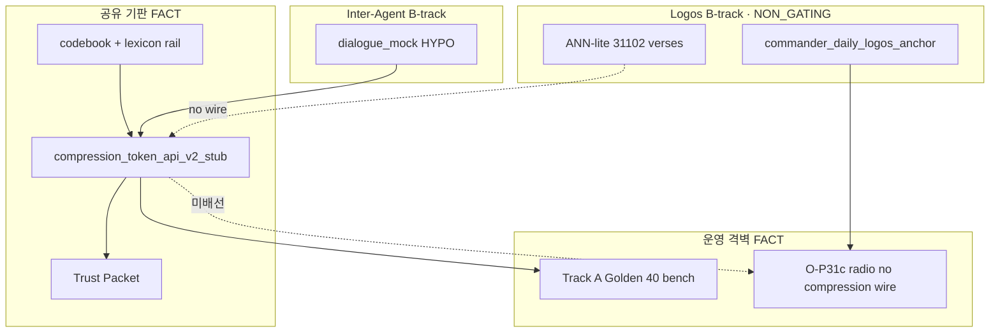

# MKM 지휘관용 쉬운 설명 맵 v1

**`[교육용 비유 · SSOT 아님]`** — 이 문서는 비기술 이해용 **은유·비유**만 담는다. 구현·수치·통과 판정은 `docs/final/CONSTITUTION_INFERENCE_IMPLEMENTATION_FACTS.md`·호출 가능 스크립트·`exit code`·아티팩트만 SSOT다. 대외 카피는 `docs/final/PUBLIC_FACING_SECURITY_AND_IP_COPY_CHECKLIST_V1.md` v1.7(은유 가드)를 따른다.

**마스터 Fact-Lock 정본(4문장):** 본 문서 말미 「Fact-Lock 정본」절. Inter-Agent·압축 상세: `docs/final/artifacts/mkm_inter_agent_wire_profile_v0.json` · `docs/final/openapi_token_compression_v2_draft.yaml`.

**Golden 40 수치 전용:** 본 비유층 **본문 표에 47.5%·0.89를 넣지 않는다.** Track A 동결 KPI는 말미 「Golden 40 벤치 전용」절·`MULTILENS_ULTRA_COMPRESSION_ACTIVE_REPORT_V1.json`만.

---

## 1. 세 명의 AI 전문가 (3대 렌즈)

**비유:** 성격이 다른 세 명의 전문가가 **각자 다른 관점**으로 조언한다.

| 렌즈 | 쉬운 역할 (비유) | Fact-Lock 각주 |
| --- | --- | --- |
| **성경 (Logos)** | 고전·인문학 **거시 앵커** — 중심·맥락 멘트 | **`[NON_GATING]`** — 가격·주문을 직접 확정하지 않음 |
| **명리** | 만세력·타이밍 — **중기 리듬** (“무리한 날/시간”) | 산출은 결정론 스크립트; **구체 멘트는 해석층** |
| **사상** | 체질·심리 **강도** — 충동 조절 **조언** | **강제 브레이크·주문 차단 아님** — 최종은 레짐+운영 게이트 |

**수정 한 줄:** 세 렌즈는 **보조 입력**이고, **최종 매매·주문은 금고(1차 레짐 + 운영 게이트 + 지휘관 승인)**만 본다. “매일 아침 셋이 회의한다”는 **운영 비유**이며 단일 회의실 프로세스가 아니다.

---

## 2. 지하 금고와 1층 공개 쇼룸·방송 (격벽)

**비유:** 건물을 둘로 나눈다.

| 층 | 비유 | 실제 레인 (포인터) |
| --- | --- | --- |
| **지하 금고** | 실매매·중요 설정 — **사람이 열쇠를 돌려야** 움직임 | `docs/final/LOCAL_VS_VPS_ONE_RULE_WORKFLOW.md` · `projects/bitcoin-trading/` |
| **1층 공개 쇼룸·방송** | `jemaai.cloud`·공개 게이트웨이·O-P31c 라디오·유튜브/숏츠 — **돈·실매매 API 자동 합선 없음** | `JEMAAI_CLOUD_PUBLIC_SHOWROOM_SPEC.md` · O-P31c: `scripts/Invoke-RadioOp31cFusionDailyChain_v1.ps1` |

**수정 한 줄:** 1층은 **보여주기·방송·공개 표면**; 지하는 **별 승인·게이트**. **자동 합선은 막음** — 해킹·무사고 **보장**은 주장하지 않는다.

---

## 3. AI끼리 주고받는 압축 패킷 (AI-to-AI · V2 Trust Packet)

**비유:** 긴 말 대신 **코드북으로 짧은 패킷** 한 장을 주고받는다 (초성·암호 **비유** — 스키마 필드명 아님).

| 비유 표현 | Fact-Lock |
| --- | --- |
| 비밀 암호책 (코드북) | `codebook/shards/zone_*.json` · `mkm_lexicon_rail_v1` |
| 한 장의 패킷 | HTTP V2 Trust Packet — `scripts/compression_token_api_v2_stub.py` |
| 압축 앵커 문자열 | `compressed_text` = `evaluate_report`가 만든 **압축 앵커**(설계도 역할). 사람용 요약문만은 **아님** |
| 0.1초 | **미측정** — “기계 왕복” 정도만 사용 |
| 우리만 아는 비밀 | **프로토콜·재현 가능** — Lingua Franca **완성·상용 SLA 미단정** |

**수정 한 줄:** AI-to-AI는 **V2 패킷·코드북 인프라 공유** (`mkm_inter_agent_wire_profile_v0`). B-track A2A 예: `scripts/run_mkm_inter_agent_dialogue_mock_v1.py` (`[HYPO]`). V2 회귀: **`test_compression_token_api_v2_stub.py` 31건** + Golden 회귀 gate.

### 3.1 Trust Packet 정밀 부품표 (Stateless · FACT)

| 부품 | 필드·메커니즘 | Fact-Lock |
| --- | --- | --- |
| **① 압축 앵커** | `compressed_text` | 복원·`codebook_only` expand의 **중심 본체** |
| **② 보조 레일** | `mkm_lexicon_rail_v1.atom_id_sequence` | **`atom_id` 문자열**(정수 번호표 아님) · 출현 순 **최대 48개** |
| **③ 샤드·정책** | `domain_router` → `zone_*.json` · `routing_profile` | 키워드 점수로 **샤드 1개** (Track A **single-route**) |
| **④ 잔여 블록** | `residual_meta.mk_stub_v2` | `stateless_packet=true`이면 **`reconstructed_text` 생략** |
| **⑤ 무손실 한정** | `lossless_text` + `hybrid_codec_v0_payload` | **바이트급 exact**는 이 결선에서만 |

---

## 4. 압축 vs Logos — 레인 격리 (FACT)

| 기능 | 담당 | 핵심 기술 | 비유 |
| --- | --- | --- | --- |
| **압축/복원 (41,775 Term)** | V2 Trust Packet | 렉시콘 **lookup** + 샤드 라우터 · **벡터 RAG 없음** | 초고속 **암호 설계도** (성경 **구절 검색기 아님**) |
| **지식 검색 (31,102 verse)** | Logos 렌즈 | ANN-lite·그래프 PoC · B-track | **도서관 검색** (`[NON_GATING]`) |

**압축에 쓰는 성경 관련 “틀”(내용·신학 아님):** ① **게마트리아** 글자→숫자 메타 ② **41,775 마스터 렉시콘** lookup ③ **`bible`/`logos` 도메인 라우팅**. **4D bridge policy는 Track A 동결 OFF.**

**RAG가 도는 곳 (압축 배관 밖):** `commander_daily_logos_anchor_v1.py`(선택 ANN) · O-P31c Zone B 대본 빌더 · `philosophy_lane_rag_pilot_v1.py` · `build_cross_lens_rag_fusion_v1.py` — **전부 B-track·해설 레인**.

**선택 부스터 (기본 OFF):** `graph_wire_selective_bridge` — GraphRAG POC가 `evaluate_report` 품질에만 간섭. **Track A·프로모션 후보 기본 `false`** · B-track 스테이징에서만 `true` 검토.

---

## 5. 두 가지 마스터 숫자 (혼동 금지)

| 구분 | 실측 치수 | 성격 | 신호 형태 |
| --- | --- | --- | --- |
| **성경 구절 코퍼스** | **31,102** `verse_id` | Logos RAG·인덱스·그래프 | **`verse_id` 포인터** (예: `Gen.1.1`) |
| **마스터 렉시콘** | **41,775** Term | atom export **종수** (132万 atom 계열에서 중복 제거·export) | V2: **`compressed_text` + atom_id + 샤드** |

**한 줄:** Logos는 **구절 ID로 책을 꺼내 읽고**, 압축은 **구절 번호가 아니라 압축 앵커·렉시콘·샤드**로 통신한다. **합선 금지.**

---

## 6. 범용화 — Core 41k + 샤드 플러그인 (`[HYPO]` V3)

**Fact-Lock:** 통짜 **수백만 단어 한 권** 확장은 **설계상 비권장** (lookup·패킷 부담). SSOT는 **41,775 고정 lookup ON** + **`codebook/shards/zone_*.json` 단일 승자 샤드** (`zone_f_code`, `zone_e_finance` 등). **multi-shard union = 로드맵.**

**입증 없는 수치 금지:** 「일반 문장 70~80% 커버」 등 **본 문서·대외 1페이지에 쓰지 않음.**

**V3 계층 스케치:** `docs/final/artifacts/universal_compression_v3_packet_sketch_v1.json` — **`research_only`·Track A/Golden 미승격** · 자유 NL은 `compression_domain_adoption_tier_matrix_v1.json` **`adopt_not_recommended`**.

---

## 7. 24시간 앰비언트 라디오 (O-P31c)

**비유:** 24시간 실시간 AI 토크는 비용·환각 리스크가 크므로 **Zone A / Zone B**로 나눈다.

| 구역 | 비유 | Fact-Lock |
| --- | --- | --- |
| **Zone A** | BGM + 구슬 영상 **루프** — 컴퓨터 부담 **낮음** | `build_radio_ambient_bed_v1.py` · `build_oracle_sphere_idle_video_bed_v1.py` |
| **Zone B** | 아침·저녁 등 **미리 만든 대본**을 끼워 넣기 | `Invoke-RadioDialogueMorningShortsChain_v1.ps1` 등 · **인간 가독 텍스트** |
| 완벽한 대본 / 환각 제로 | **금지** — 카피 가드·게이트·승인 있음, **완벽 주장 없음** |
| Zone B에서 V2 Trust Packet | **아님** — `compression_token_api_v2_stub` **미배선** (라디오 스크립트 grep **0건**) |

**수정 한 줄:** 평소 **가벼운 Zone A**, 특정 시간만 **검증된 Zone B 대본**. Logos 앵커는 `commander_daily_logos_anchor_v1.py` → JSON; **압축 엔진과 자동 합선 없음**.

---

## 토폴로지 (Fact-Lock · 입체 규격)

---

## Fact-Lock 정본 (4문장 · 마스터)

1. **인프라:** AI-to-AI 인코딩은 **HTTP V2 Trust Packet과 동일 패킷·코드북 인프라**를 쓰며 `mkm_inter_agent_wire_profile_v0`가 계약을 고정한다. Lingua Franca **완성·상용 SLA 미단정** — 대외·브리핑에서는 **`[research_only]`·B-track** 경계를 유지한다.
2. **수치:** **Golden 40** 벤치만 Track A 동결 KPI — 상세는 아래 「Golden 40 벤치 전용」. Stateless PoC·Inter-Agent·L1 인간 복원은 **별 KPI**.
3. **Track C:** O-P31c·공개 쇼룸은 **인간 가독 대본·표면** 레인. Trust Packet A2A는 **B-track만** — 라디오·실매매 **자동 합선 없음**.
4. **검증:** V2 pytest **31건** + `check_compression_golden_bench_regression_v1.py` + 일요일 `MKM_Compression_WeeklyGovernance` **`-IncludeStatelessTrustPacket`**.

---

## Golden 40 벤치 전용 (대외 1페이지·비유 본문 금지)

| KPI | SSOT 값 | 조건 |
| --- | --- | --- |
| Token saving | **~47.5%** | `MULTILENS_ULTRA_COMPRESSION_ACTIVE_REPORT_V1.json` |
| Jaccard proxy | **~0.89** avg | 동일 · **의미 보존 % 아님** |
| 4D bridge | **OFF** | `apply_gematria_4d_bridge_policy: false` |

**LG·9장 슬라이드·내부 벤치 보고에만** 사용. AI-to-AI·방송·전 도메인 **일반화 금지**.

---

## 대외·홍보 NEVER (요약)

- 47.5% / 0.89를 **전 도메인·AI-to-AI 품질·방송 효과**로 일반화 (비유 본문에도 **직접 수치 박지 말 것**)
- O-P31c **내부 토큰 대화·완벽 방송·환각 제로**
- **해킹 불가·무사고 보장**
- 렌즈가 **주문·매매를 직접 확정**한다는 서술
- **pytest 36** · **뼈대 70~80%** · **V3 상용 완료** 등 SSOT 없는 수치·상태

---

**갱신:** 2026-05-23 — §3.1·§4·§5·§6·Golden 40 격리·§2 쇼룸 확장. 에이전트는 본문 수치를 임의 수정하지 말고, 변경 시 SSOT 아티팩트·스크립트 exit code로만 갱신한다.
