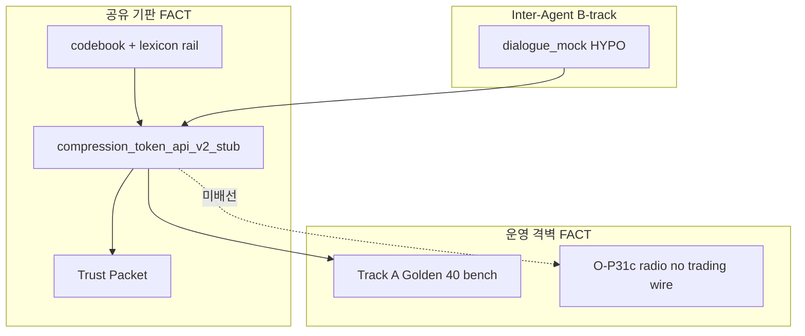

# MKM 지휘관용 쉬운 설명 맵 v1

**`[교육용 비유 · SSOT 아님]`** — 이 문서는 비기술 이해용 **은유·비유**만 담는다. 구현·수치·통과 판정은 `docs/final/CONSTITUTION_INFERENCE_IMPLEMENTATION_FACTS.md`·호출 가능 스크립트·`exit code`·아티팩트만 SSOT다. 대외 카피는 `docs/final/PUBLIC_FACING_SECURITY_AND_IP_COPY_CHECKLIST_V1.md` v1.7(은유 가드)를 따른다.

**마스터 Fact-Lock 정본(4문장):** 본 문서 말미 「Fact-Lock 정본」절. Inter-Agent·압축 상세: `docs/final/artifacts/mkm_inter_agent_wire_profile_v0.json` · `docs/final/openapi_token_compression_v2_draft.yaml`.

---

## 1. 세 명의 AI 전문가 (3대 렌즈)

**비유:** 성격이 다른 세 명의 전문가가 **각자 다른 관점**으로 조언한다.

| 렌즈 | 쉬운 역할 (비유) | Fact-Lock 각주 |
| --- | --- | --- |
| **성경 (Logos)** | 고전·인문학 **거시 앵커** — 중심·맥락 멘트 | **`[NON_GATING]`** — 가격·주문을 직접 확정하지 않음 |
| **명리** | 만세력·타이밍 — **중기 리듬** (“무리한 날/시간”) | 산출은 결정론 스크립트; **구체 멘트는 해석층** |
| **사상** | 체질·심리 **강도** — 충동 조절 **조언** | **강제 브레이크·주문 차단 아님** — 최종은 레짐+운영 게이트 |

**수정 한 줄:** 세 렌즈는 **보조 입력**이고, **최종 매매·주문은 금고(1차 레짐 + 운영 게이트 + 지휘관 승인)**만 본다. “매일 아침 셋이 회의한다”는 **운영 비유**이며 단일 회의실 프로세스가 아니다.

---

## 2. 지하 금고와 1층 홍보관 (격벽)

**비유:** 건물을 둘로 나눈다.

| 층 | 비유 | 실제 레인 (포인터) |
| --- | --- | --- |
| **지하 금고** | 실매매·중요 설정 — **사람이 열쇠를 돌려야** 움직임 | `docs/final/LOCAL_VS_VPS_ONE_RULE_WORKFLOW.md` · `projects/bitcoin-trading/` |
| **1층 홍보관** | 유튜브·텔레그램 방송 — **돈과 자동 합선 없음** | O-P31c: `scripts/Invoke-RadioOp31cFusionDailyChain_v1.ps1` |

**수정 한 줄:** 1층은 **보여주기·방송**; 지하는 **별 승인·게이트**. **자동 합선은 막음** — 해킹·무사고 **보장**은 주장하지 않는다.

---

## 3. AI끼리 주고받는 압축 패킷 (AI-to-AI · V2 Trust Packet)

**비유:** 긴 말 대신 **코드북으로 짧은 패킷** 한 장을 주고받는다 (초성·암호 **비유** — 스키마 필드명 아님).

| 비유 표현 | Fact-Lock |
| --- | --- |
| 비밀 암호책 (코드북) | `codebook/shards/zone_*.json` · `mkm_lexicon_rail_v1` |
| 한 장의 패킷 | HTTP V2 Trust Packet — `scripts/compression_token_api_v2_stub.py` |
| **~47.5% 절감** | **Track A Golden 40 벤치만** (`MULTILENS_ULTRA_COMPRESSION_ACTIVE_REPORT_V1.json`, bridge OFF). Stateless PoC·A2A mock·L1 인간 복원은 **별 KPI** |
| 0.1초 | **미측정** — “기계 왕복” 정도만 사용 |
| 우리만 아는 비밀 | **프로토콜·재현 가능** — Lingua Franca **완성·상용 SLA 미단정** |

**수정 한 줄:** AI-to-AI는 **V2 패킷·코드북 인프라 공유** (`mkm_inter_agent_wire_profile_v0`). B-track A2A 예: `scripts/run_mkm_inter_agent_dialogue_mock_v1.py` (`[HYPO]`). V2 회귀: **`test_compression_token_api_v2_stub.py` 31건** + Golden 회귀 gate.

---

## 4. 24시간 앰비언트 라디오 (O-P31c)

**비유:** 24시간 실시간 AI 토크는 비용·환각 리스크가 크므로 **Zone A / Zone B**로 나눈다.

| 구역 | 비유 | Fact-Lock |
| --- | --- | --- |
| **Zone A** | BGM + 구슬 영상 **루프** — 컴퓨터 부담 **낮음** | `build_radio_ambient_bed_v1.py` · `build_oracle_sphere_idle_video_bed_v1.py` |
| **Zone B** | 아침·저녁 등 **미리 만든 대본**을 끼워 넣기 | `Invoke-RadioDialogueMorningShortsChain_v1.ps1` 등 · **인간 가독 텍스트** |
| 완벽한 대본 / 환각 제로 | **금지** — 카피 가드·게이트·승인 있음, **완벽 주장 없음** |
| Zone B에서 토큰 A2A 실시간 대화 | **아님** — Trust Packet 대화는 **별 B-track**, 라디오에 **미배선** |

**수정 한 줄:** 평소 **가벼운 Zone A**, 특정 시간만 **검증된 Zone B 대본**. O-P31c A2A 압축 융합 서사는 배선 전 **`[HYPO]`**.

---

## 토폴로지 (Fact-Lock · 입체 규격)

---

## Fact-Lock 정본 (4문장 · 마스터)

1. **인프라:** AI-to-AI 인코딩은 **HTTP V2 Trust Packet과 동일 패킷·코드북 인프라**를 쓰며 `mkm_inter_agent_wire_profile_v0`가 계약을 고정한다. Lingua Franca **완성·상용 SLA 미단정** — 대외·브리핑에서는 **`[research_only]`·B-track** 경계를 유지한다.
2. **수치:** **Golden 40** 벤치 **~47.5% saving · ~0.89 Jaccard** (bridge OFF)만 Track A 고정 벤치. Stateless PoC(~0.78 예시), Inter-Agent M1 in-process(~0.43), L1 인간 exact(~58% 스파이크)는 **별 KPI**.
3. **Track C:** O-P31c는 **인간 가독 대본 + TTS(Zone B)** 독립 레인. Trust Packet A2A는 `run_mkm_inter_agent_dialogue_mock_v1.py` 등 **B-track만** — 라디오 **자동 합선 없음**.
4. **검증:** V2 pytest **31건** + `check_compression_golden_bench_regression_v1.py` + 일요일 `MKM_Compression_WeeklyGovernance` **`-IncludeStatelessTrustPacket`**.

---

## 대외·홍보 NEVER (요약)

- 47.5% / 0.89를 **전 도메인·AI-to-AI 품질·방송 효과**로 일반화
- O-P31c **내부 토큰 대화·완벽 방송·환각 제로**
- **해킹 불가·무사고 보장**
- 렌즈가 **주문·매매를 직접 확정**한다는 서술
- **pytest 36** 등 SSOT에 없는 수치

---

**갱신:** 에이전트는 본문 수치를 임의 수정하지 말고, 변경 시 위 SSOT 아티팩트·스크립트 exit code로만 갱신한다.
